# Datadrive

Datadrive is the cloud storage provided by Glows.ai. It can be mounted into your virtual machine or container when you create an instance, and lets you access and share data across different instances.

---

## **Datadrive Main Page**

Click **Data Drive** in the sidebar to enter the page. This page directly shows the data you've stored, along with a variety of operations. You can manage your data files through an intuitive interface.
  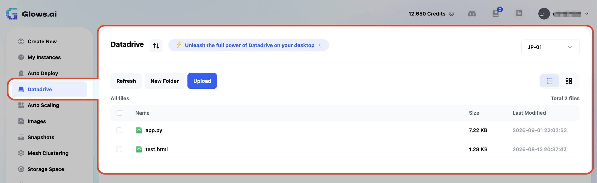

This page shows tabs for different regions. Datadrive data in different regions is independent of one another, for example:
  1. **JP-01**
  2. **TW-03**
  3. **TW-04**
  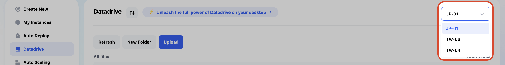

---

## **Main Screen Button Functions**

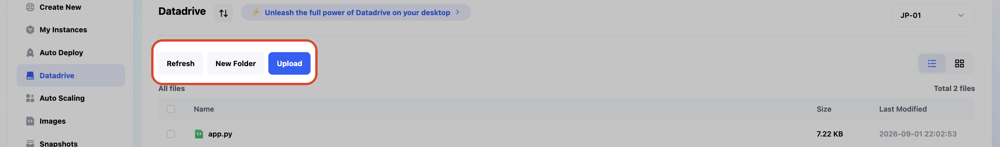

### **1. Refresh**

- **Function**: Refresh the list to show the latest state of files and folders.

### **2. New Folder**

- **Function**: Create a new folder.
- **Steps**:
  1. Click the **New Folder** button.
  2. Enter a folder name in the dialog that appears.
  3. Once confirmed, the new folder will appear in the list.

### **3. Upload**

- **Function**: Upload files to the current region (e.g., `JP-01`, `TW-04`, etc.).
  >Note: The web version of Datadrive does not support uploading folders. If you need to upload a folder, please use the Datadrive desktop app.
- **Steps**:
  1. Click the **Upload** button.
  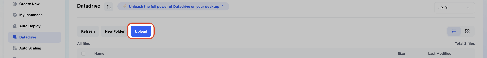

  2. Choose the file to upload.
  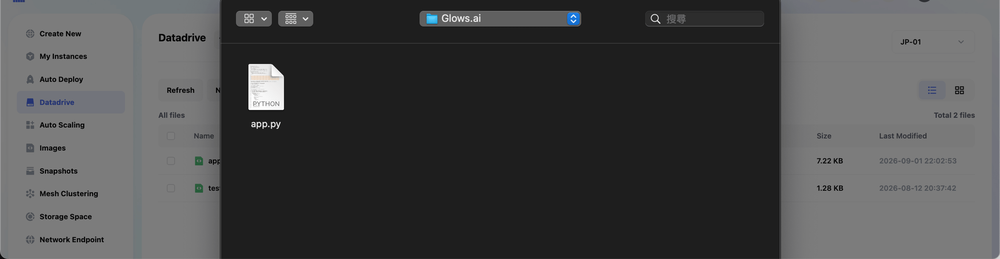

  3. Once the upload is complete, the file will appear in the list.

---

## **File and Folder List**

On the Datadrive main page, you'll see a list of all files and folders, including the following fields:

- **Name**: The name of the file or folder.
- **Size**: The size of the file or folder.
- **Last Modified**: The last modified time of the file or folder.
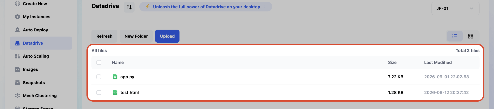

### **File Action Buttons (Actions)**

Clicking or hovering over any row provides the following options:

- **Download**: Download the selected file.
  > **Note**: This only works for files — folders cannot be downloaded directly.
- **Move**: Move the file or folder to another location.
- **Rename**: Rename the file or folder.
- **Delete**: Delete the selected file or folder.
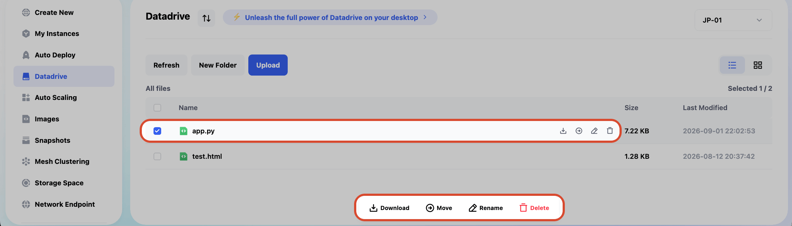

---
## **Mounting / Using Datadrive**

### Mounting Datadrive When Creating an Instance

 **Steps**:
  1. Click `Create New` to start creating an instance, then click `Mount` in the **Mount Datadrive** field under detailed settings.
    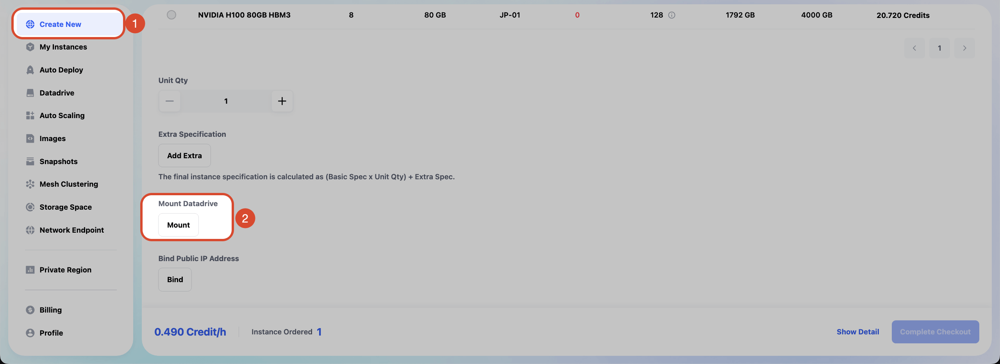

  2. **Information in the Mount Datadrive popup**:
    - **Region**: Choose the region of the Datadrive you want to mount (e.g., `TW-03`, etc.).
      > Note that an instance can only mount a Datadrive in the same region.
    - **Usage**: The current used capacity / total capacity of the Datadrive in that region.
    - **Mount Path**: The path the Datadrive is mounted to inside the instance, `/datadrive` by default.
    - **Permissions**: The read/write permissions after mounting, either `Read only` or `Read & write`.
    - After clicking `Mount`, create the instance to complete the mount.
      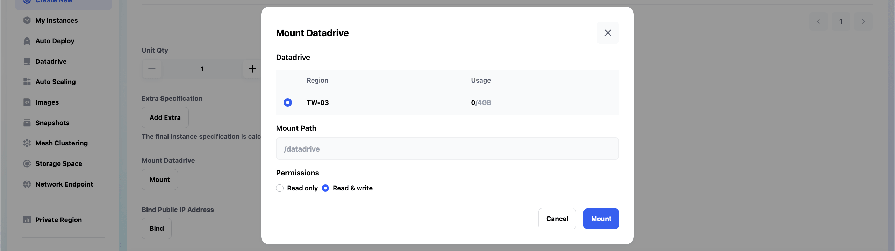

  3. **Creating the Instance**:

      Once mounted successfully, the Datadrive information will be shown. After confirming everything is correct, click `Complete Checkout` to create the instance with the Datadrive mounted.
      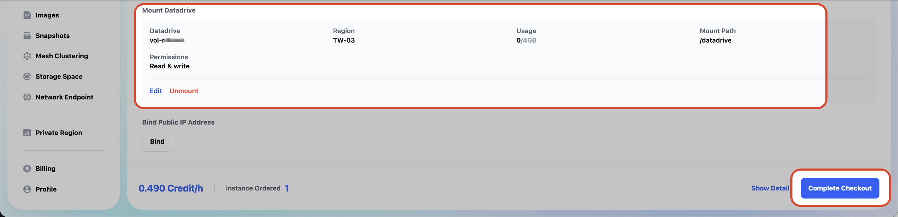

### Using Datadrive Inside an Instance

 **Steps**:
  1. After creating an instance with a Datadrive mounted, click the instance's Datadrive tab in the instance list to see the Datadrive information.
  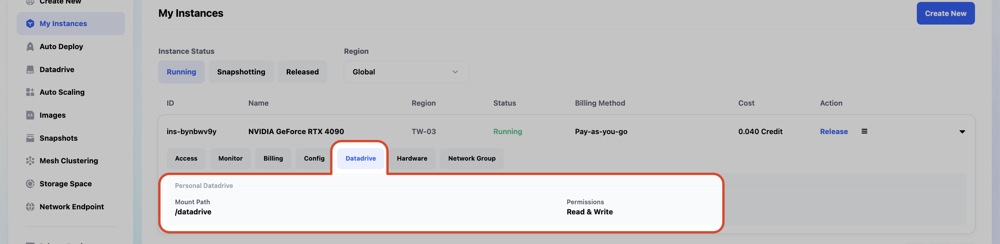

  2. Once you've SSH'd into the instance, you can access the Datadrive's data through the default path `/datadrive`.
   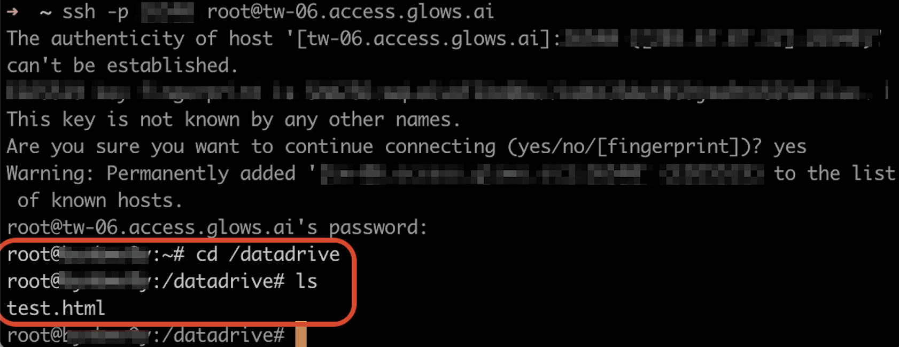

---

## **Notes**

1. **File and Folder Operations**:
   - Note that folders cannot be downloaded directly.
   - All delete or move operations require selecting the target item first.

2. **Naming Rules**:
   - When editing a name, avoid using special characters or duplicate names.

3. **File Size Limits**:
   - When uploading files, please make sure the file size is within the system's allowed limit.

This covers the complete functionality of the **Datadrive** page. For further assistance, please refer to the related guides.
