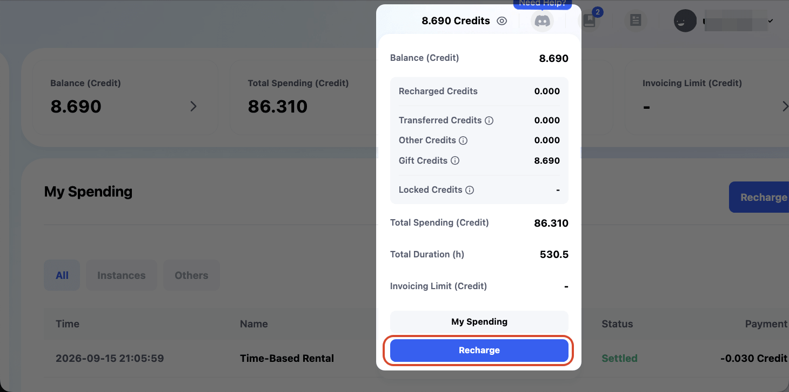

# Billing System

On the **Billing** page, you can view and manage your expenses and balance.

## Billing Main Page
### Top Dashboard

- **Balance (Credit)**: Your current balance, e.g., 11.860. Click it to view credit details and recharge.
- **Total Spending (Credit)**: Total expenses, e.g., 83.150.
- **Total Duration (h)**: Total usage time, e.g., 520.8 hours.
- **Invoicing Limit (Credit)**: Currently no limit.

### My Spending

- Shows detailed information for each transaction, including **Time, Name, Status, Payment**.
- You can also filter by transaction type, including **Instances, Others**.

## **Recharging Credits**

1. Click the `Recharge` button next to **My Spending**.
2. After clicking, you will enter the recharge screen, displaying **My Balance** and **Buy Credit** options.
   > You can select a preset amount or customize the recharge amount.
3. Choose the **Payment Currency** (currently supporting USD and TWD).
4. Choose the **Payment Method** (currently supporting PayPal, NewebPay, and Stripe).
5. Confirm the displayed amount is correct, then click **Recharge** to complete the recharge.

- This recharge feature is the same as the `Recharge` option shown in the list after clicking the Credit balance in the top navigation bar.

