# My Instance

**My Instance** ページでは、すべてのインスタンスの状態と設定を確認・管理できます。以下で機能を詳しくご紹介します。

---

## **インスタンスの状態**

**My Instance** ページでは、次の 4 種類のインスタンス状態を確認できます：

1. **Pending**：インスタンスが起動中です。
1. **Running**：インスタンスが稼働中で、アクセスや管理操作が可能です。⚠️ **課金が発生するのはこの状態のときのみ**ですので、利用時間を適切に管理してください。
2. **Suspending**：インスタンスが Take Snapshot 処理を実行中で、他の管理操作は一時的に行えません。この状態では**追加の課金は発生しません**。
3. **Terminated**：インスタンスは解放され、リソースは回収されています。この状態のインスタンスは再起動できず、**それ以降の課金も発生しません**。
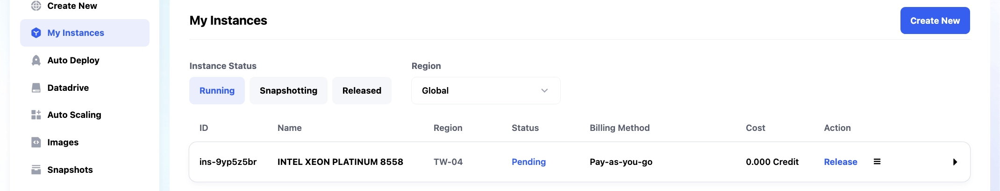
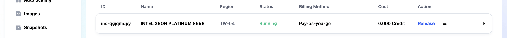
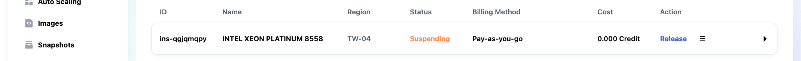

**各状態には、以下の項目を持つインスタンス一覧があります**：

- **ID**：各インスタンスの一意の識別子。
- **Name**：識別しやすいインスタンス名。
- **Region**：インスタンスが配置されているリージョン（例：TW-03、TW-04）。
- **Status**：インスタンスの現在の状態（例：Running、Pending）。
- **Billing Method**：課金方式。現在は従量課金（pay-as-you-go）とサブスクリプションに対応しています。
- **Cost**：これまでにインスタンスに累積した費用。
- **Action**：インスタンスに対して実行できる操作（詳細は下記参照）。

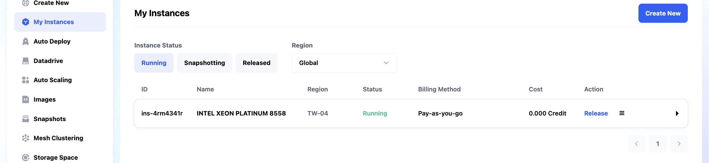

## **タブ**

インスタンス一覧の行をクリックすると、該当インスタンスの詳細を確認し、以下のタブから管理できます：

### **1. Access**

インスタンスへの接続方法を確認・設定します。

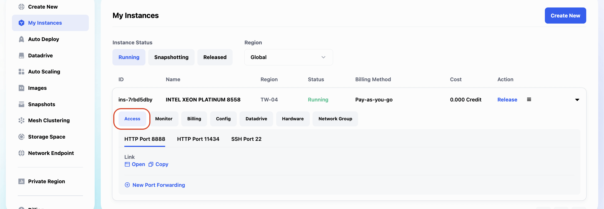

- **SSH Port 22**

  - SSH 接続に必要な情報を確認できます：
    - **SSH Command**：`ssh -p <Service Port> root@<Access URL>`
    - **Service Port**：このインスタンスのサービスポート。
    - **User**：デフォルトのユーザー名は `root` です。
    - **Password**：初期パスワード（暗号化して表示されます）。
    - **SSH Key**：パスワードの代わりに SSH キーでログインすることもできます。左側サイドバーの `Profile` から `SSH keys` をクリックして設定してください。
    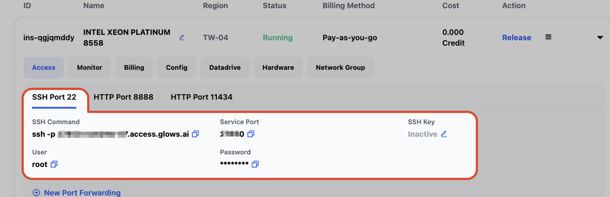

- **HTTP Port 8888**
  このポートにはデフォルトで JupyterLab がデプロイされています。Open をクリックするとインスタンスへ直接アクセスできます。

  - 利用できる操作：
    - **Open**：新しいタブでリンクを開きます。
    - **Copy**：HTTP アドレスをコピーします。
    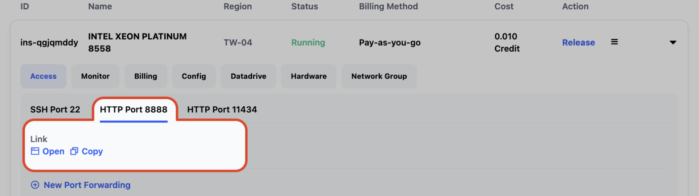

- **New Port Forwarding**：このボタンをクリックすると、新しいポートフォワーディングルールを追加できます。
  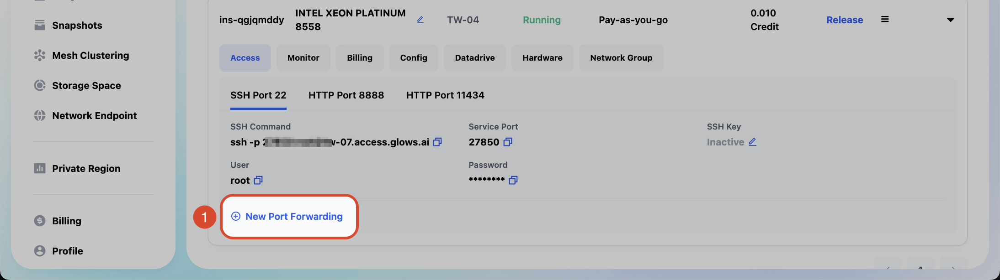
  以下の情報を入力してください：
  - **Service Port**：サービスポートを設定します。
  - **Protocol**：サービスのプロトコルタイプを選択します。デフォルトは TCP です。JupyterLab やダッシュボードなどの Web 系サービスを転送する場合は、`HTTPS` にチェックを入れて暗号化アクセスを有効にし、ブラウザ接続の安全性を確保してください。
  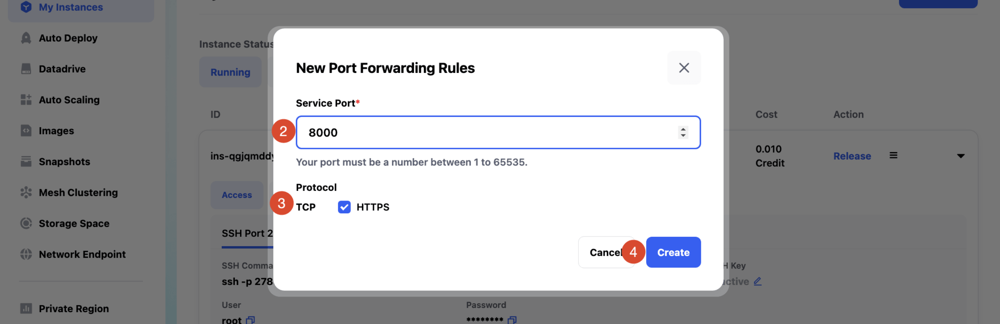

### **2. Monitor**

インスタンスのパフォーマンスとリソース使用状況をリアルタイムで確認します。

   - **CPU Usage**：インスタンスの現在の CPU 使用率。
    - **Memory Usage**：現在のメモリ使用量／割り当てられたメモリ総容量。
    - **Disk Usage**：現在のディスク使用量／割り当てられたストレージ総容量。
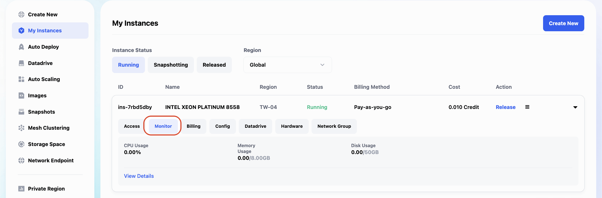

### **3. Billing**

インスタンスに関するすべての課金詳細を表示します。

   - **Start Time**：インスタンスの起動時刻。
    - **End Time**：インスタンスの終了時刻（稼働中の場合は `Running` などの現在の状態が表示されます）。
    - **Price/Hour**：インスタンスの時間あたりの課金額。
    - **Cost**：これまでの累計費用。
    - **Duration**：インスタンスの稼働時間。
    - **Billing Method**：課金方式。`Pay-as-you-go` またはサブスクリプション。
    - **Discount**：現在適用されている割引。
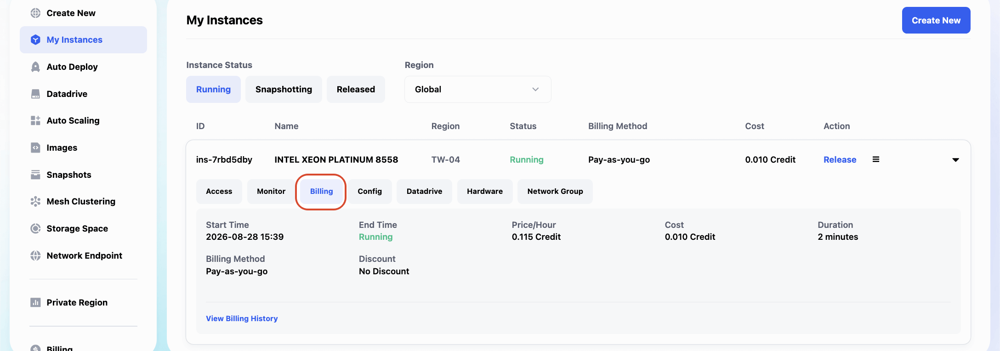

### **4. Config**

イメージ関連のパラメータ設定など、インスタンスの設定内容を確認します。

   - **Image**：インスタンスで使用しているイメージ名。
    - **Image Description**：イメージの詳細情報。必要なハードウェアリソース、OS、プリインストール済みパッケージのバージョンなどを含みます。
    - **Ports**：イメージがデフォルトで公開しているサービスポート。
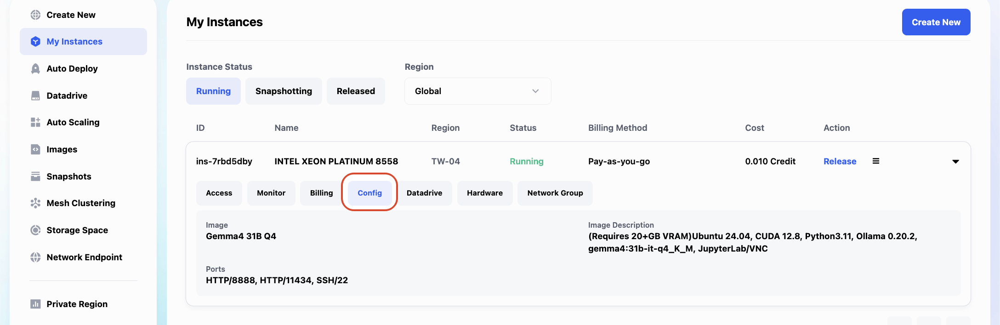

### **5. Datadrive**

イメージ関連のパラメータ設定など、インスタンスの設定内容を確認します。

   - **Mount Path**：インスタンス内で Datadrive がマウントされているパス。
   - **Permissions**：Datadrive の読み書き権限。
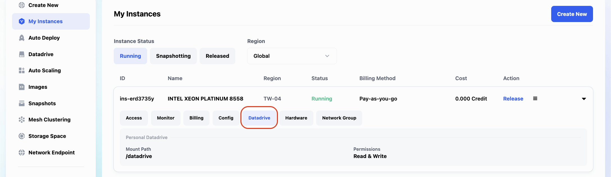

### **6. Hardware**

GPU・CPU モデル、メモリ、ストレージなど、インスタンスのハードウェア構成を確認します。

   - **GPU Model**：インスタンスに設定されている GPU モデル。
    - **GPUs**：割り当てられている GPU の数。
    - **GPU RAM**：GPU 1 枚あたりのビデオメモリ容量。
    - **CPU Model**：インスタンスに設定されている CPU モデル。
    - **vCPUs**：割り当てられている仮想 CPU コア数。
    - **RAM**：システムメモリ容量。
    - **Storage**：ディスクストレージ容量。
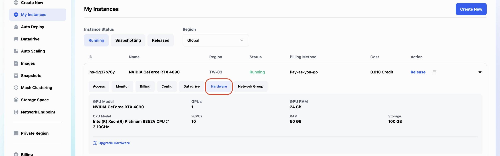

### **7. Network Group**

インスタンスのクラスターネットワーク情報を確認します。Glows.ai はマルチノード・マルチ GPU 運用に対応しており、Mesh 内で複数のインスタンスを同一クラスターに追加することで、クラスター内のインスタンス同士が内部 IP を通じて通信でき、より効率的な計算連携が可能になります。

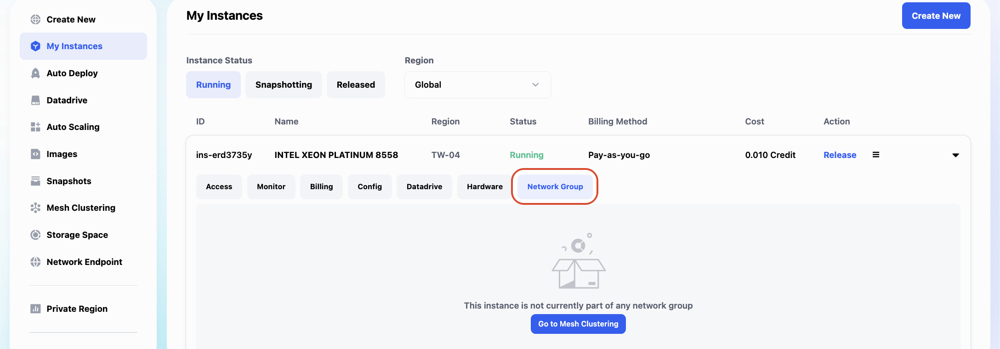

---

## **インスタンスが Running 状態のときに実行できる操作**

Action 列には `Take Snapshot` と `Release` の 2 つのボタンがあります。

### **1. Take Snapshot**

- **機能**：現在のインスタンスのスナップショットを作成し、`/datadrive` を除くすべての状態とファイルの変更内容（インストール済みパッケージ、システム設定、その他ディレクトリの変更など）を保存します。
- **利用シーン**：
  - インスタンス環境に多くのカスタム設定（Python パッケージや Ubuntu ソフトウェアのインストールなど）を行い、現在の状態を保存して、後で素早く再現したい場合。
  - 今後新しいインスタンスを作成する際のベーステンプレートとして使用し、設定の繰り返しを避けたい場合。

#### **Take Snapshot の詳細な操作手順**

1. **Action 列の `Take Snapshot` ボタンをクリックすると、スナップショット作成ウィンドウが開きます。**

   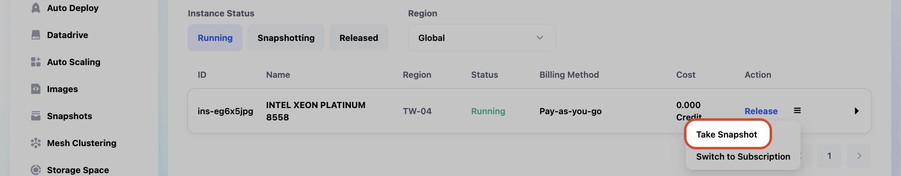

2. **スナップショット情報を入力します**：

   - **Name**：スナップショットの名前を入力します。
   - **The instance will be automatically released after the process is completed**：
      チェックを入れると、スナップショット完成後にインスタンスは自動的に解放されます。
     チェックを入れない場合、スナップショット完成後にインスタンスは自動的に Running 状態に戻り、そのまま利用を継続できます。
        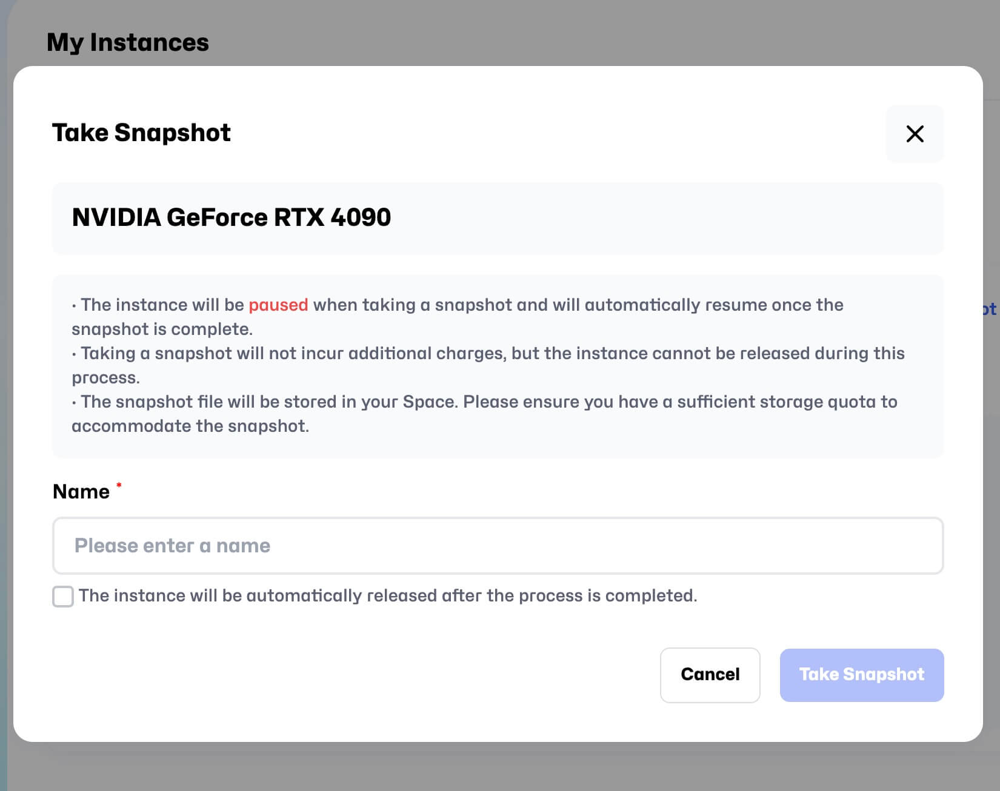

3. **スナップショットの進行状況を確認します**：

   - 保存処理中は、インスタンスは `Running` タブから `Snapshotting` タブへ移動します：

      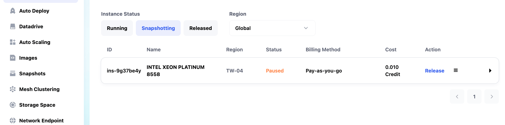

4. **完了後の影響**：

   - スナップショット保存中はインスタンスが一時停止し、保存完了後（自動解放にチェックしたかどうかによって）自動的に稼働再開または解放されます。
      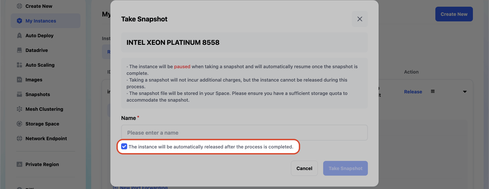

#### **注意事項**

- 保存処理中はインスタンスを一時的に利用できず、接続が自動的に回復してから再度操作できます。
- スナップショットの保存には十分な個人ストレージ容量が必要ですので、事前にご確認ください。

---

### **2. Release**

- **機能**：インスタンスのリソースを解放し、インスタンスを **Released** 状態に変更します。
- **利用シーン**：インスタンスが不要になった場合、解放することでリソースを回収し、課金を停止できます。

#### **Release の詳細な操作手順**

1. **Action 列の `Release` ボタンをクリック**すると、確認ウィンドウが開きます。

   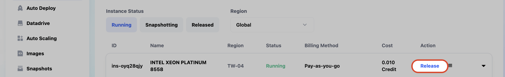

2. **解放を確認します**：

   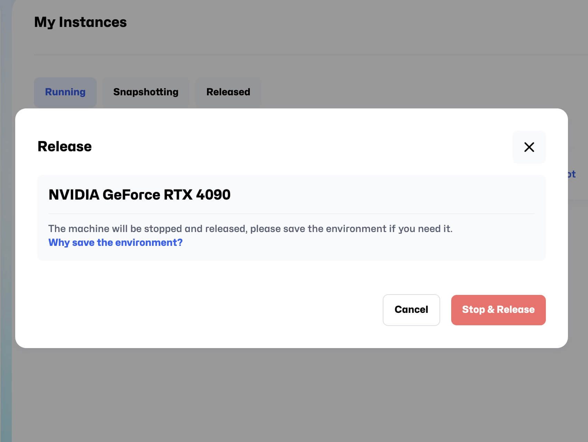
   - システムがデータ削除や取り消し不可であることなど、関連する注意事項を表示します。
   - `Stop & Release` をクリックして解放を確定します。

3. **解放処理中のステータス更新**：

   - 解放されたインスタンスは `Released` 領域に表示されます。ステータスは **Terminated** に変わります。
   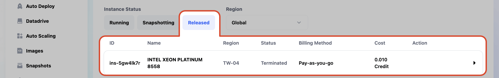

4. **Snapshot から新しいインスタンスを起動する方法：**

   - インスタンスを作成する際に Snapshot を選択し、インスタンスを起動します。
   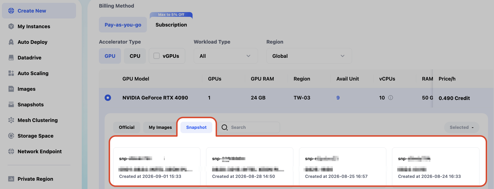

   - インスタンスのスナップショット作成が完了した後：保存完了後にインスタンスを解放するオプションにチェックを入れていなければ、My Instance 画面の Running 内でそのインスタンスを確認できます。チェックを入れていた場合は、スナップショット完了後もインスタンスは稼働を継続します。
   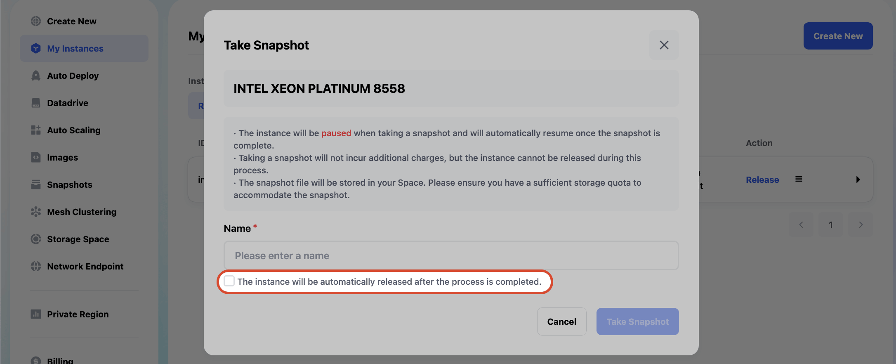

#### **注意**：スナップショット作成中はインスタンスにアクセスできず、インスタンス内で実行中のプロセスは中断されます。一般的には、マシンを使い終わって解放する前にスナップショットを作成することをお勧めします。

---

## **注意事項まとめ**

1. **Snapshotting および Released の制限**：

   - これらの 2 つの状態では、**Config** と **Hardware** タブのみ確認可能で、他の操作は実行できません。

2. **Release と Snapshot に関する推奨事項**：

   - インスタンスを解放する前に、現在のデータを保持する必要があるかどうか必ず確認してください。
   - 定期的にスナップショットを作成することで、重要なデータを保護できます。

3. **操作による影響**：

   - スナップショット作成やインスタンス解放などの一部操作は、インスタンスの通常利用を中断する可能性がありますので、時間配分にご注意ください。

以上がインスタンス管理に関する完全なガイドです。より詳しい内容については、以降の章をご参照ください。
