# Glows.ai チーム版利用マニュアル

Glows.ai のチーム版機能は、チームコラボレーションの仕組みを構築し、リソースの一元管理、柔軟なクォータ配分、安全な共有メカニズムを実現することで、エンタープライズユーザーのクラウドリソース共有ニーズに対応します。

本マニュアルは以下の 3 部構成です：

- [作成者向けマニュアル](#作成者向けマニュアル)
- [管理者向けマニュアル](#管理者向けマニュアル)
- [一般メンバー向けマニュアル](#一般メンバー向けマニュアル)

------

## 作成者向けマニュアル

### チームの作成

Glows.ai にログイン後、画面右上のユーザー情報をクリックし、表示されたポップアップで `Teams` をクリックします。続いて `Create Teams` をクリックすると、チーム作成プロセスが開始されます。

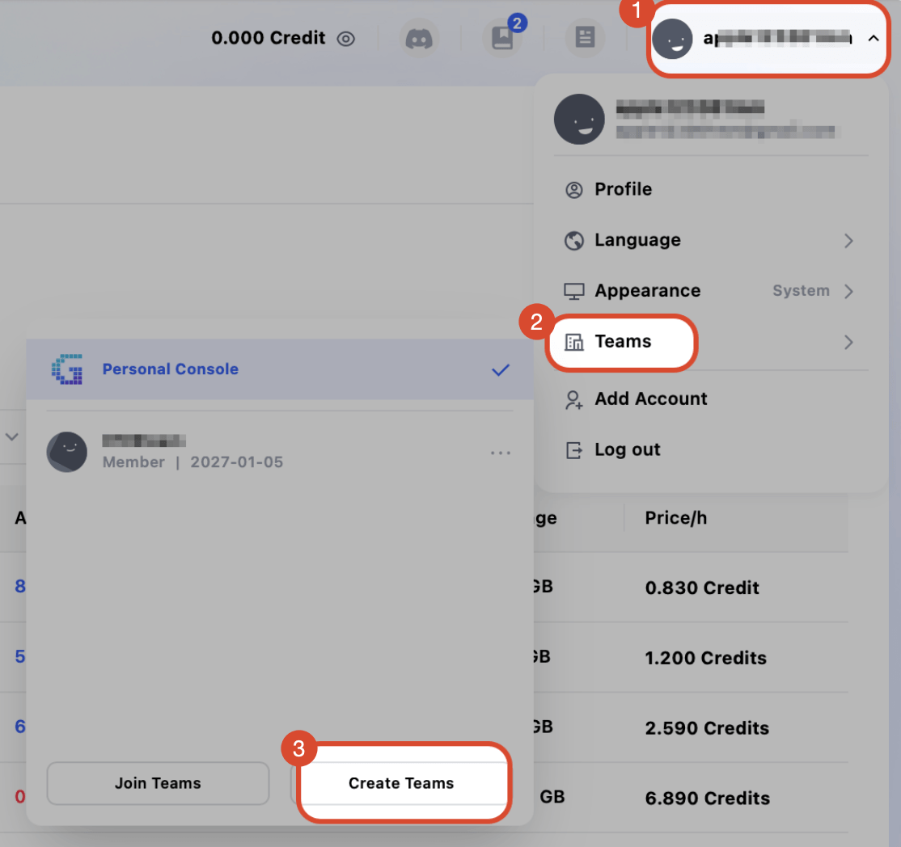

現在は Free、Basic、Premium の 3 つのプランがあります。チームのプロジェクトに合ったプランを選択してください。より高度な要件がある場合は、`Contact us` をクリックしてカスタム開発についてお問い合わせください。

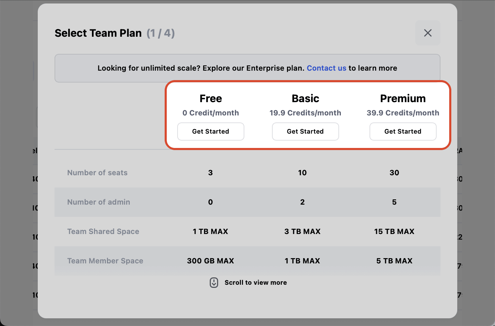

チームプランのタイプを選択したら、続けてチーム名と概要を設定できます。

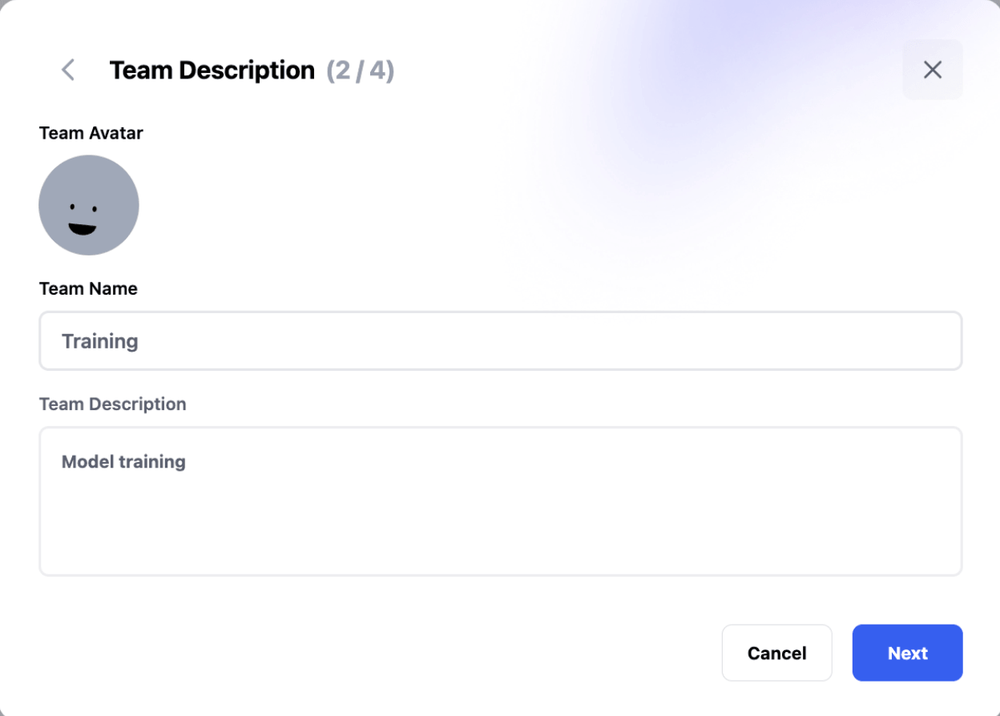

プランの購入期間を選択します（後から手動で更新することも可能です）。設定後、`Next` をクリックしてください。

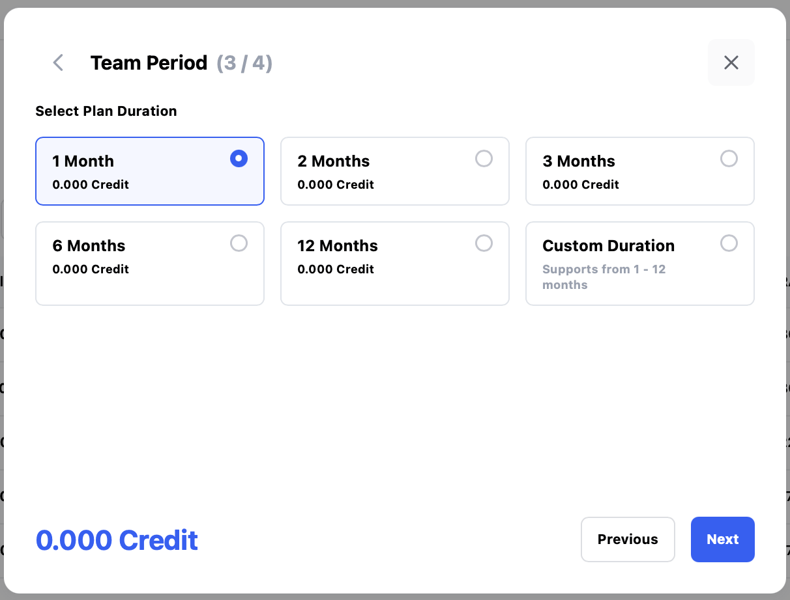


入力内容に誤りがないことを確認したら、`Create Team` をクリックしてチーム作成を完了します。

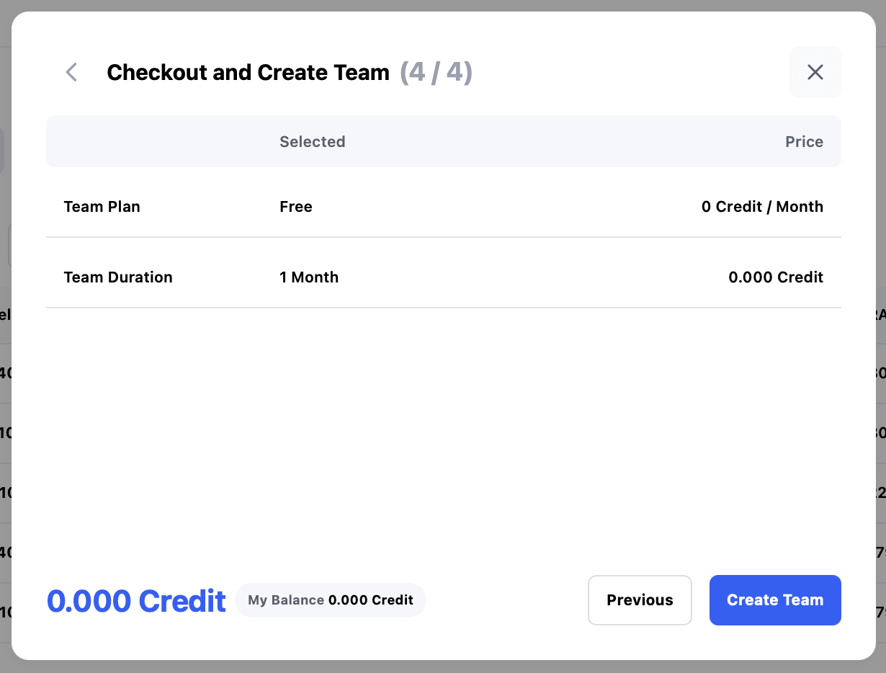


作成が完了すると、チームの基本情報が表示され、あなたはこのチームの **Owner（作成者）** になります。この権限は自動的にあなたの個人アカウントに紐づけられ、今後は個人アカウントからチームページにアクセスできます。

`Enter Team` をクリックすると、直接チームページへ移動できます。

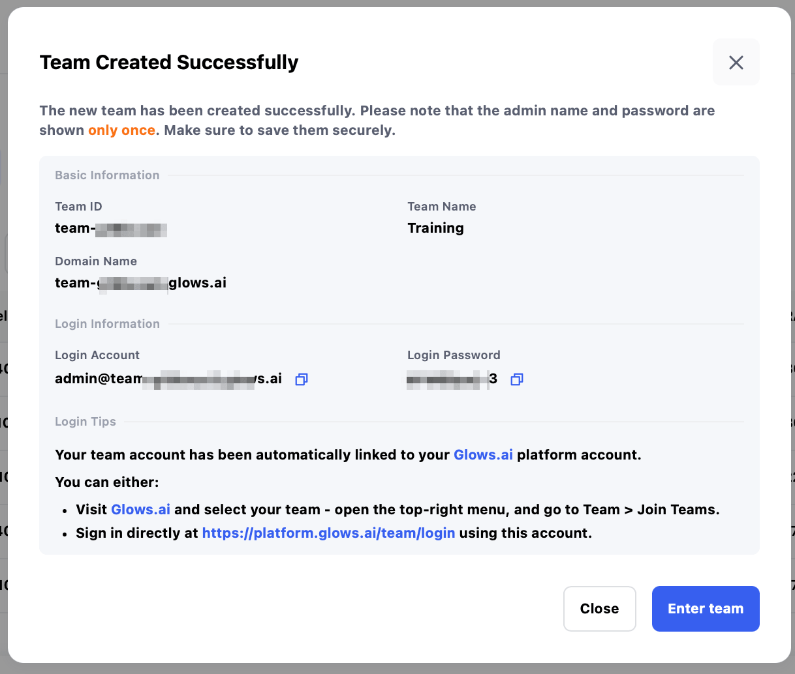


### チーム画面への切り替え

Glows.ai の個人アカウントページから、直接チーム版へ切り替えることができます。図のとおり右上のユーザー情報をクリックし、表示されたポップアップで `Teams` を選択し、入りたいチームをクリックしてください。

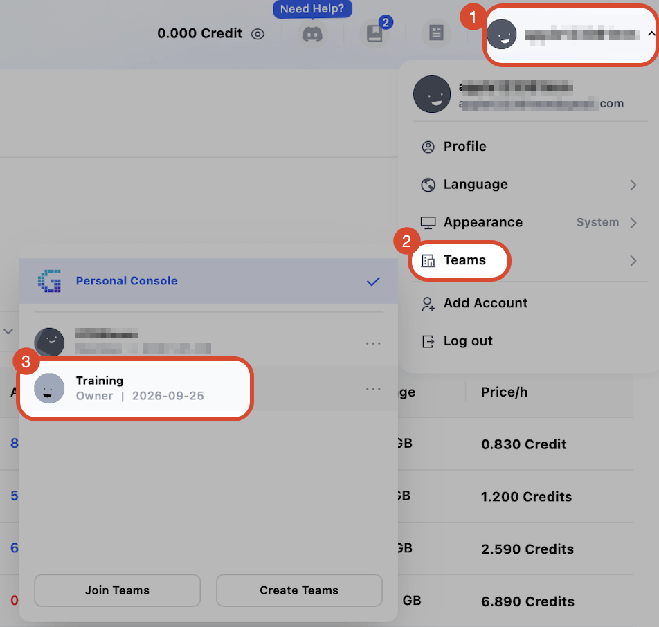


### メンバー管理

チーム作成者または管理者アカウントでログイン後、左側サイドバーの `Member` タブをクリックしてメンバー管理を行うことができます。現在対応している機能は、**メンバーの追加**、**Credits の割り当て**、**メンバー Credits の回収**、**リソースの可視性コントロール**、**メンバー基本情報の編集**、**メンバーインスタンスの管理**などです。

#### メンバーの追加

`Member` 画面にある `Add Members` ボタンをクリックすると、メンバー追加の手続きに進みます。

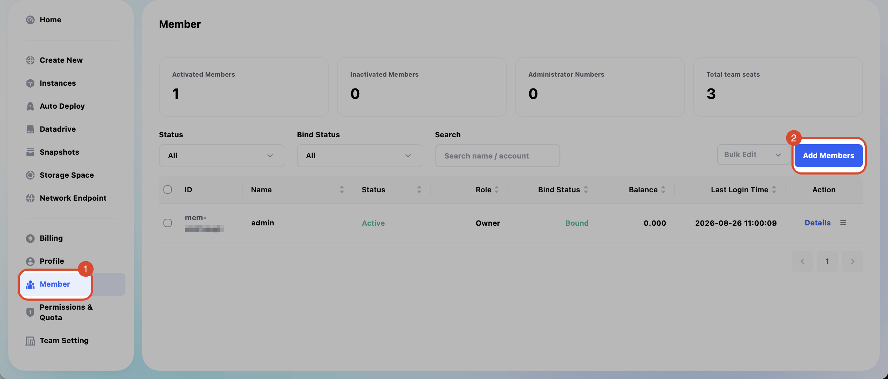


新規メンバーには、**ログインアカウント（Login Account）**、**ログインパスワード（Login Password）**、**ロール（Role）**、**初期クレジット（Assign Credit）**、**エイリアス（Alias）**、**説明（Note）** を設定できます。設定が完了したら、画面内の `Add Member` ボタンをクリックしてメンバー作成を完了します。

ロール（Role）は現在、**Admin**（管理者）または **Member**（一般メンバー）のいずれかに設定できます。

**Assign Credits**（クレジット割り当て）は、メンバーがチームに参加した際に受け取る初期クレジット数を設定するもので、マシンのレンタルや **Storage Space** プランの購入に利用できます。メンバー作成後に追加で割り当てることも可能です。

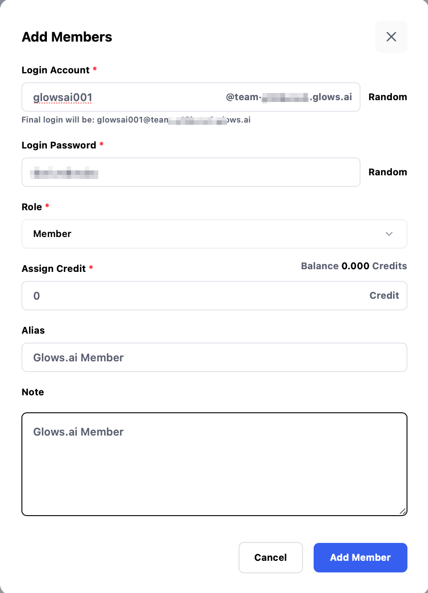


作成が完了したら、`Copy Login Details` をクリックして新規メンバーの情報を取得し、本人に送付してください。新規メンバーのログイン方法については、[チームへの参加](#チームへの参加)をご参照ください。

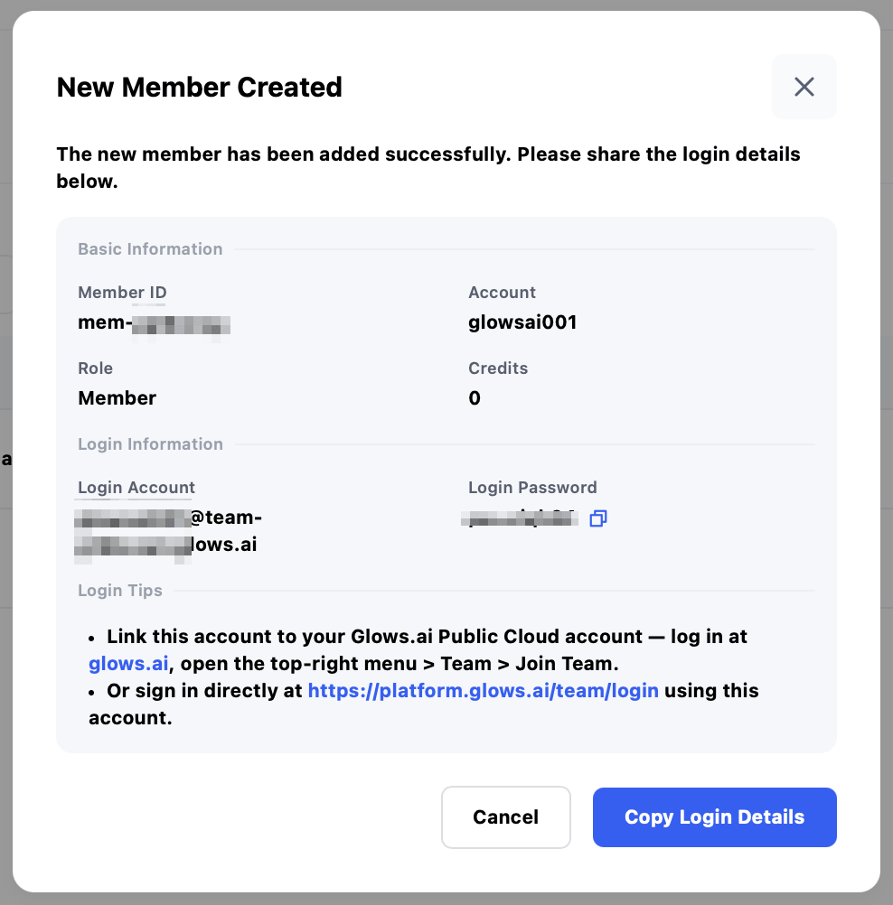


#### Credits のチャージ

チームメンバーが使用するすべての Credits は、まず **Owner（作成者）** がチームにチャージし、その後メンバーへ割り当てる必要があります。
チーム版ページで、**Owner** はまず右上の **Credits 情報** をクリックし、続けて `Recharge` をクリックしてチャージを開始します。

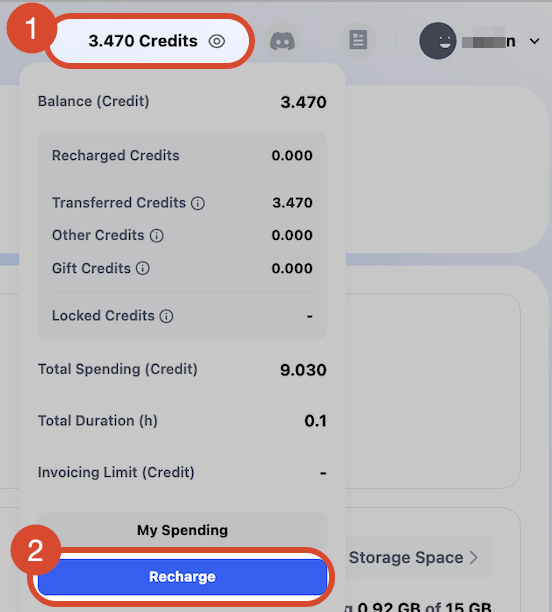

個人版と同じチャージ方法に加えて、チーム版では **Owner** が個人アカウントの Credits をチームアカウントにチャージすることもできます。

**Credits 数量** を選択または入力し、`USD` を選択したうえで `Glows.ai Balance` を選択し、`Recharge` をクリックするとチャージが完了します。
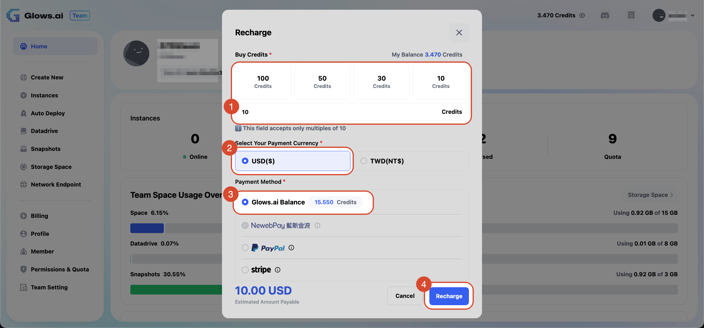


#### Credits の割り当て

`Member` 画面で対象メンバーの Action ボタンをクリックし、`Assign Credits` を選択して割り当て画面を開きます。

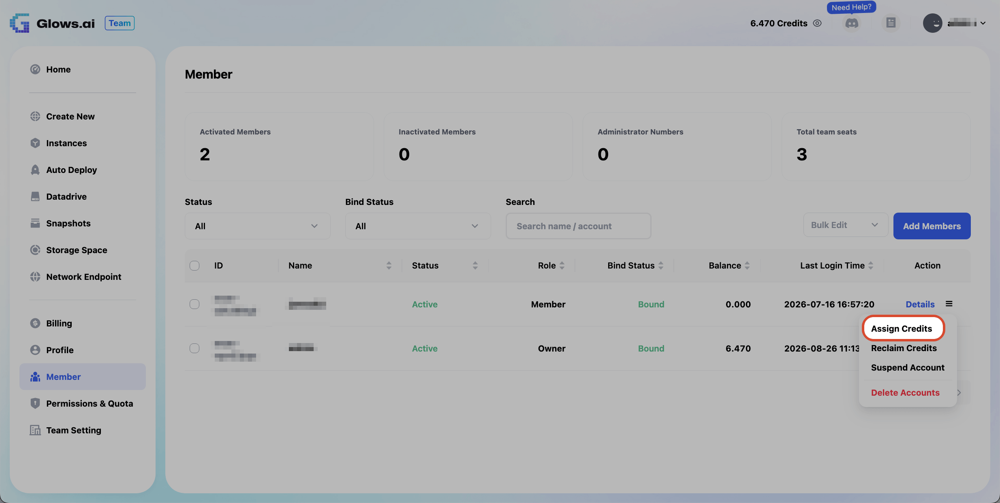


割り当てる金額を入力し、`Assign` をクリックすると割り当てが完了します。

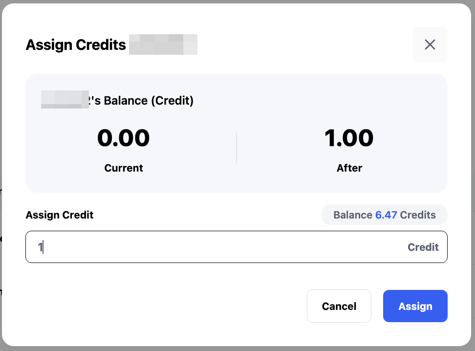

#### Credits の回収

同じ画面で `Reclaim Credits` を選択すると、メンバーの Credits を回収できます。操作方法は割り当てと同じです。

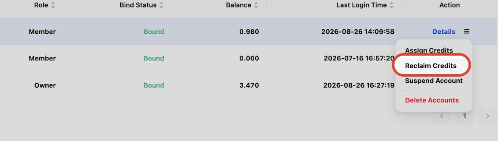


#### リソースの可視性コントロール

`Permissions & Quota` では、チームメンバーがどの GPU、イメージ、利用可能なインスタンス総数、ストレージ総容量を見られるかを設定できます。

`Permissions & Quota` をクリックすると権限設定画面が開き、まずチームメンバーに表示するマシンリソースを、**リージョン（Region）**、**タイプ（Type）**、**アクセラレータ（Accelerator）** の単位でコントロールできます。

図の例では、チームメンバーが利用できるのは **TW-03**、**TW-04** リージョンの **GPU** タイプのマシンのみで、スペックは **NVIDIA GeForce RTX 4090** のみに限定されています。

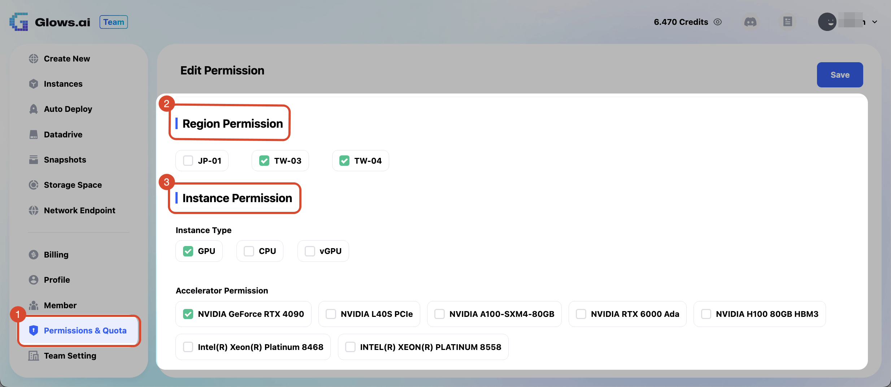


さらに下にスクロールすると、メンバーが使用できる公式ベースイメージを設定できます。図の例では、チームメンバーは **Gemma4 31B Q8** と **Qwen3.5-27B-Claude-4.6-Opus-Q8** の 2 種類のイメージのみでインスタンスを作成できるよう制限されています。

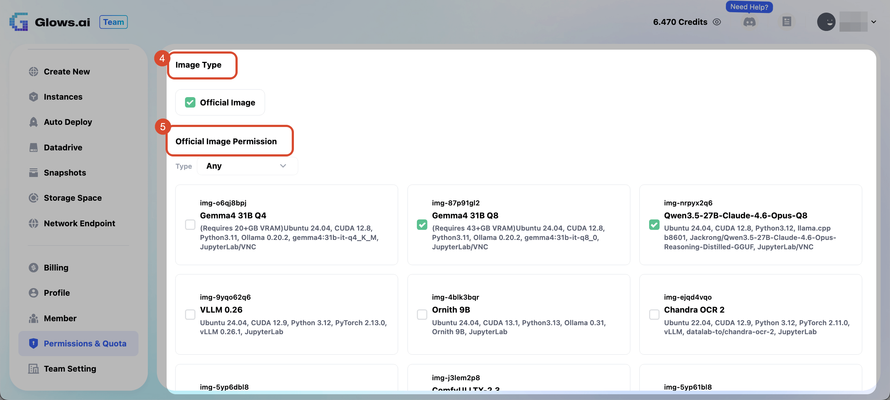


最後に、チームメンバーのインスタンスデータ、**Snapshots** の数、**Storage Space** の利用可能容量などを設定できます。

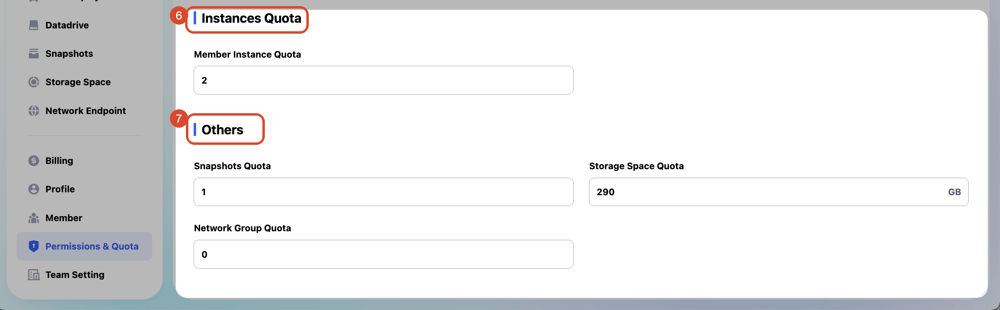


設定が完了したら、右上の `Save` ボタンをクリックして保存します。以降、チームメンバーが `Create New` をクリックしてインスタンスを作成する際に選択できるマシンは、`Permissions & Quota` で設定したマシンタイプと環境に限定されます。

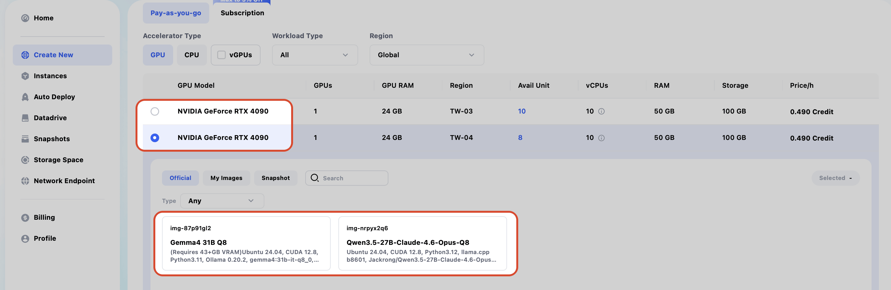


#### メンバー基本情報の編集

`Member` 画面で対象メンバーの `Details` ボタンをクリックすると、メンバー詳細パネルが開きます。

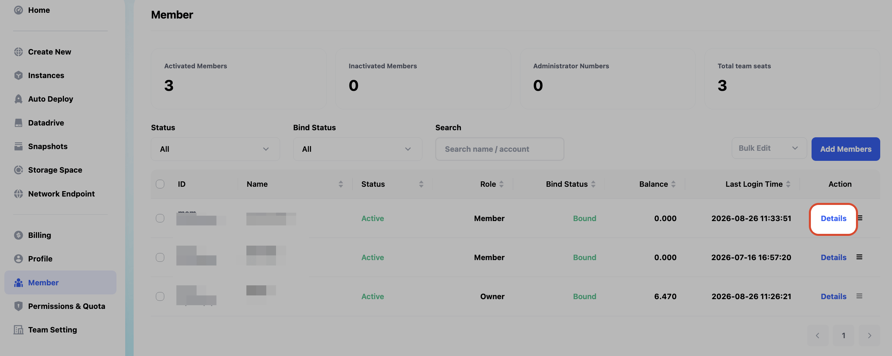


現在、メンバーの **Name**、**Role**（例：**Admin** または **Member**）、**Account Balance**、**Note**、**Login Password** を編集できます。詳細パネルでは、残クレジット、総支出、インスタンス数、ストレージ使用状況など、メンバーの他の利用情報も確認できます。

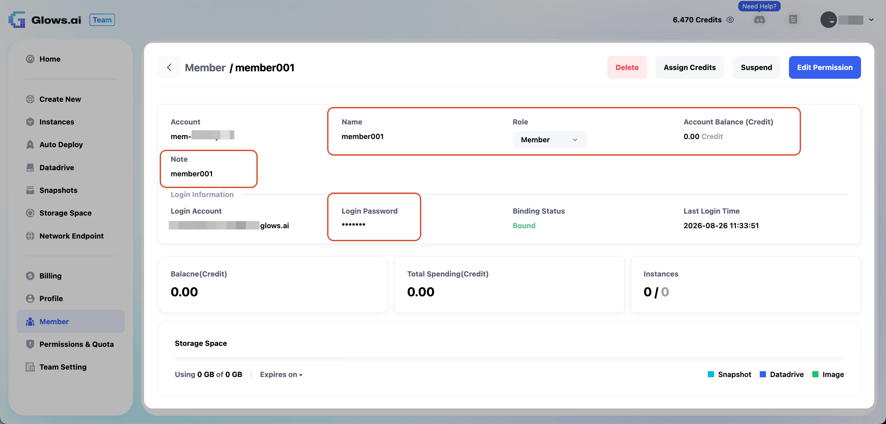


この画面右上の `Edit Permission` をクリックすると、メンバー個別のリソース可視性を設定でき、メンバーごとに異なるマシン・イメージリソースを見せることができます。

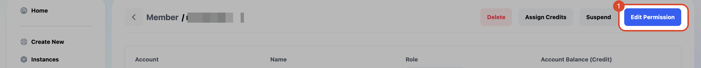

**Use Team Default Permission** を `On` から `Off` に切り替えることで設定できます。

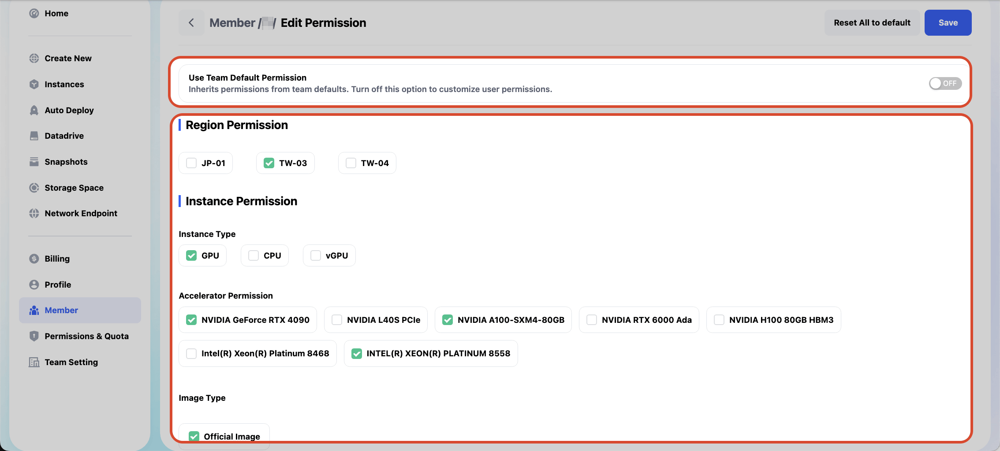


#### メンバーインスタンスの管理

`Instances` 画面で `Admin View` をクリックすると、すべてのメンバーのインスタンス記録と稼働状況を確認できます。

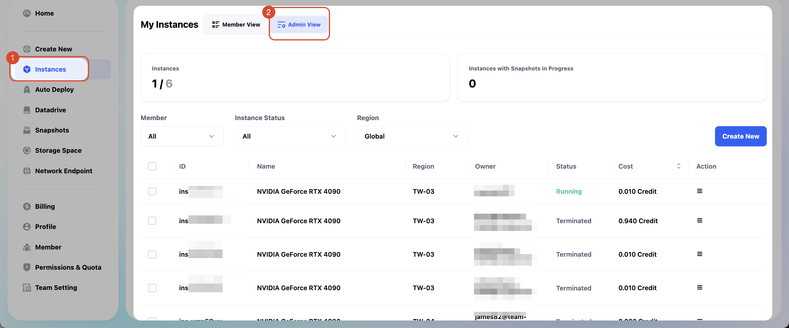


停止したいメンバーインスタンスの行にある `Action` をクリックし、続けて `Release` をクリックすると、そのメンバーのインスタンスを直接解放できます。

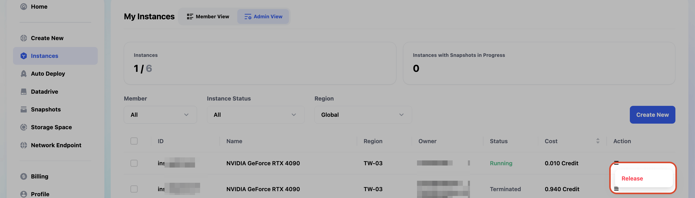


### Storage Space 管理

#### チーム共有 Storage Space プランの購入

`Storage Space` 画面で `Admin View` を選択し、`Upgrade` ボタンをクリックして必要なプランを選択したうえで `Recharge` をクリックすると、Storage Space の購入が完了します。

**注意**：チーム共有の Storage Space プランを購入する際は、図の手順のとおり先に `Admin View` をクリックしてください。`Member View` の状態で購入すると、それはチーム版内の個人 Storage Space プランになります。

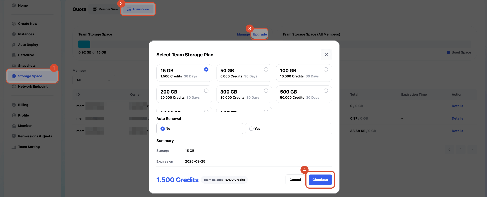


#### チーム共有 Storage Space の配分

`Storage Space` 画面で `Admin View` を選択すると、チーム共有 Storage Space の使用状況、およびチーム内各メンバーの個人 Storage Space の使用状況を確認できます。

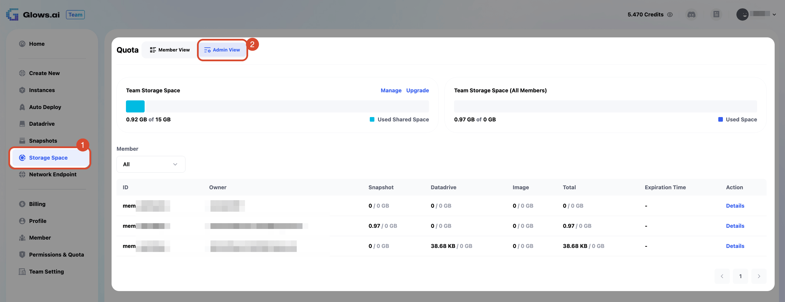


`Storage Space` 画面で `Admin View` を選択した後、**Team Storage Space** の `Manage` ボタンをクリックします。

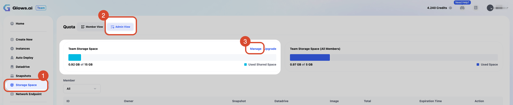

チーム共有 Storage Space の配分画面に入ったら、`Modify` をクリックして **Datadrive** と **Snapshot** のスペースクォータを設定し、最後に `Update` をクリックすると配分が完了します。配分方法は個人版と同じです。

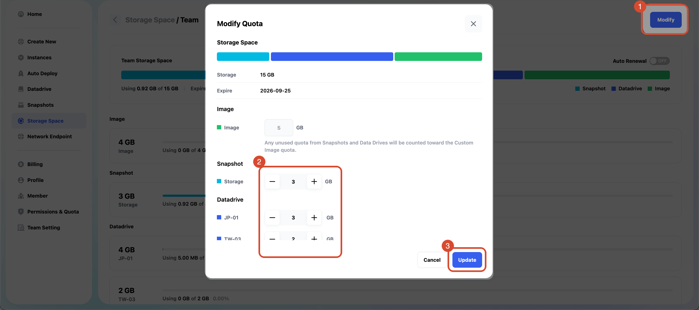


### 共有 Datadrive 管理

サイドバーの `Datadrive` をクリックし、画面で `Admin View` を選択すると、チーム共有 Datadrive の使用状況、および各チームメンバーの個人 Datadrive の使用状況を確認できます。

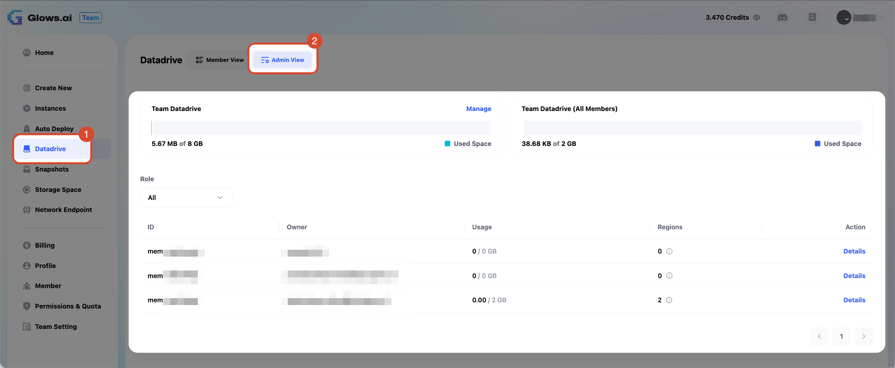


`Team Datadrive` の `Manage` ボタンをクリックすると、チーム Datadrive 管理画面が開きます。

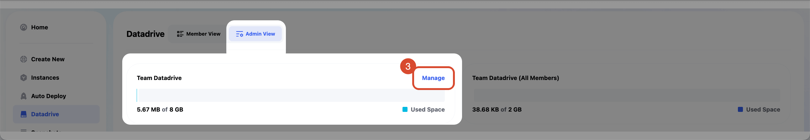

この画面では、**リージョン（Region）** ごとの共有 Datadrive のファイル一覧を確認できます。チーム共有 Datadrive へのファイルのアップロード・削除は、チームの **Owner** と **管理者（Admin）** のみが行えます。すべてのメンバーはファイルの **ダウンロード（Download）** が可能です。

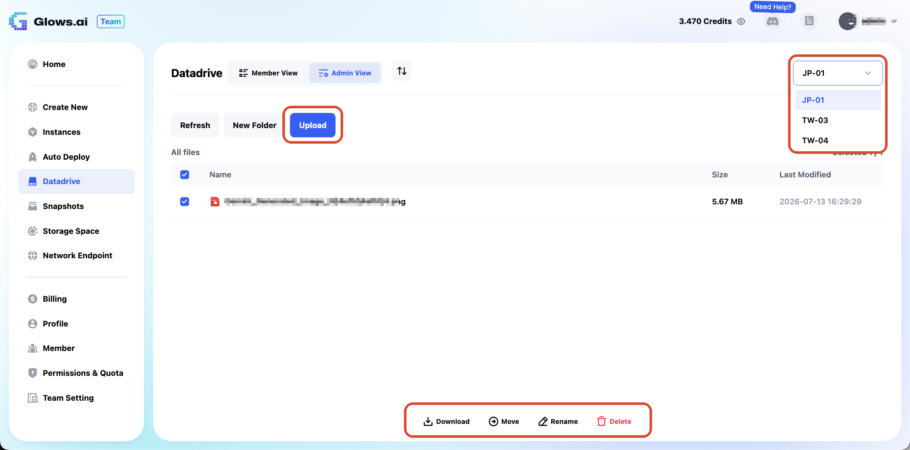


他のメンバーはインスタンス作成時にチーム共有 Datadrive をマウントすることを選択できます。インスタンス内でのパスは `/team_data` で、一般メンバーは読み取り専用権限のみ、チーム作成者と管理者は読み書き権限を持ちます。

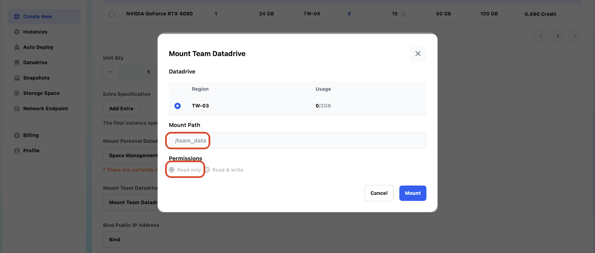


### Snapshots 管理

`Snapshots` 画面で `Admin View` を選択すると、チームおよび各チームメンバー個人が作成した Snapshot を確認できます。

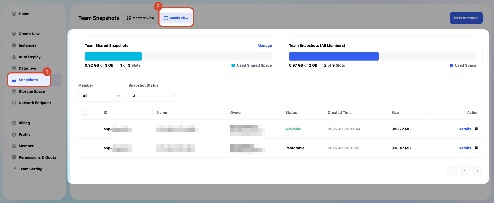


#### チーム共有 Snapshot の設定

チーム共有に切り替えたい Snapshot の `Details` をクリックし、続けて `Share to team` を選択すると、メンバーが作成した Snapshot をチーム共有 Snapshot に変更できます。

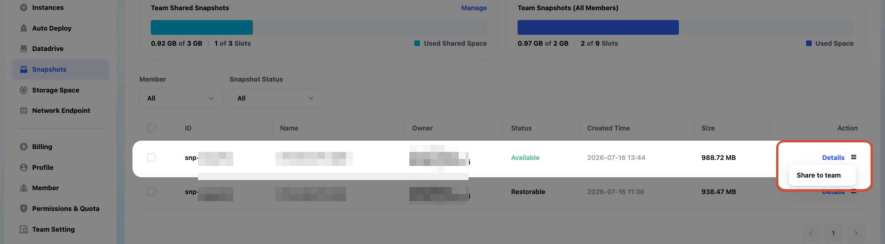


#### チーム共有 Snapshot の利用

他のメンバーがインスタンスを作成する際に Snapshot を選択すると、チーム共有の Snapshot が表示されます。チーム共有の Snapshot には右上に **Team** マークが付いています。

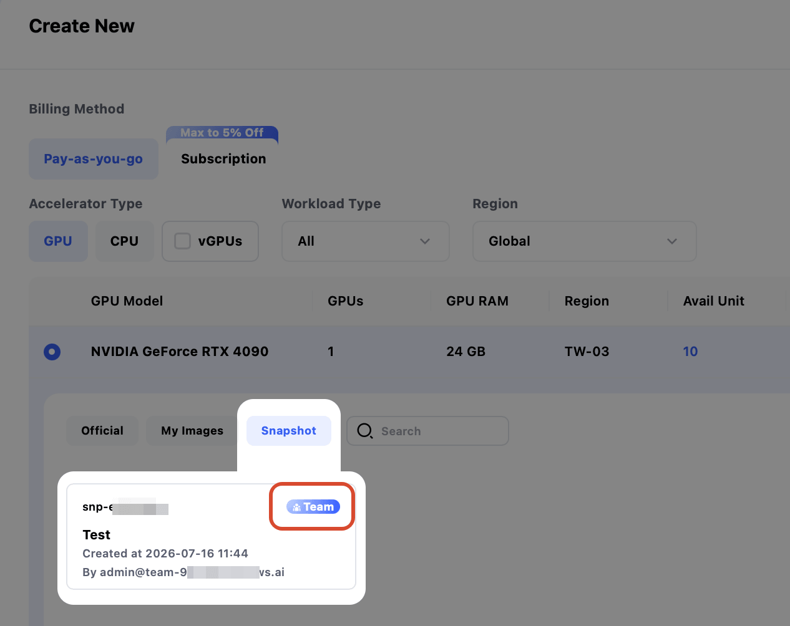


#### チーム Snapshot の管理

`Snapshots` 画面で `Admin View` を選択した後、`Team Shared Snapshots` モジュール右上の `Manage` ボタンをクリックすると、チーム Snapshot 管理画面が開きます。

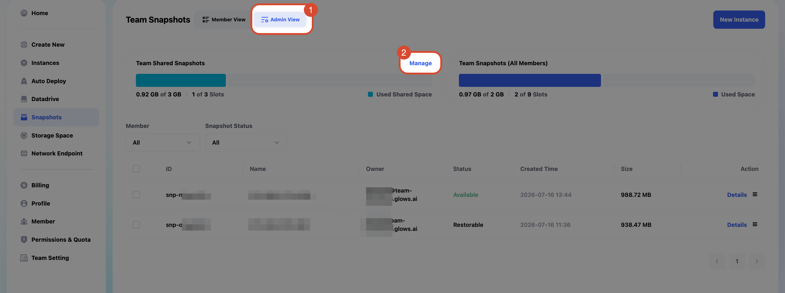


この画面ではすべてのチーム Snapshot を確認できます。現在対応している操作は削除のみです。不要な Snapshot を選択し、`Action` の `Delete` をクリックすると削除できます。

**注意**：チーム Snapshot を削除すると完全に削除され、復元はできません。操作には十分ご注意ください。

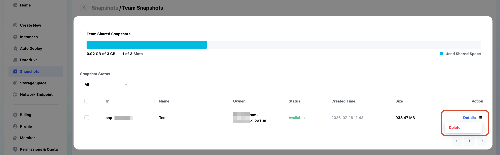


### Billing 管理

`Billing` 画面で `Admin View` を選択すると、すべてのチームメンバーの帳単データを確認できます。

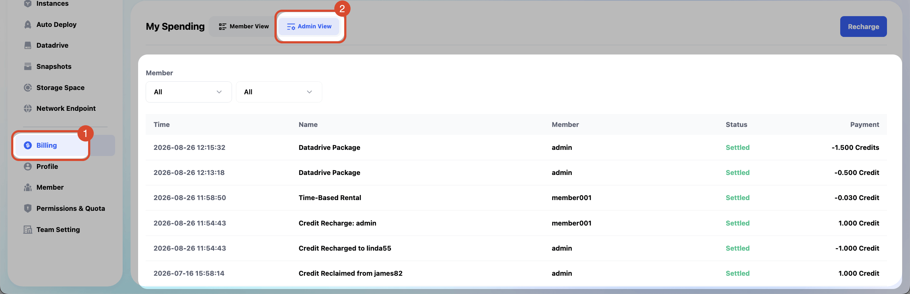

帳単の検索は、メンバー単位・課金タイプ単位でのフィルタリングに対応しています。

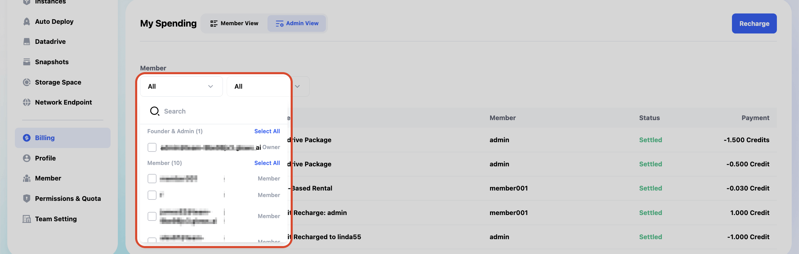
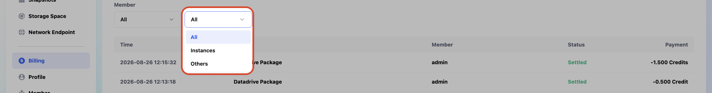


### チーム情報の編集

`Team Setting` 画面で右上の `Edit` ボタンをクリックすると、チームの名前と概要を編集できます。

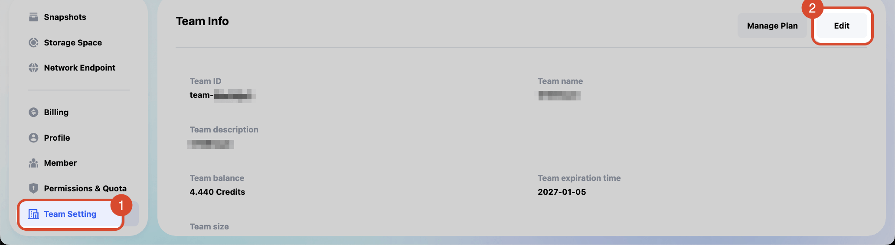
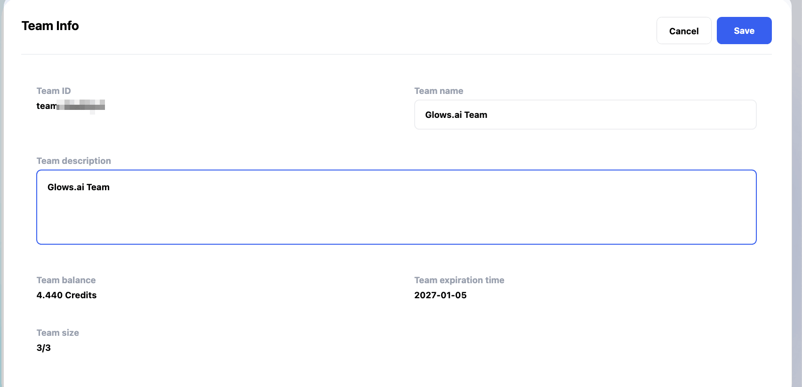


## 管理者向けマニュアル

管理者は、チームの作成とチャージができない点を除いて、チーム作成者と同じ権限を持ちます。詳しくは[作成者向けマニュアル](#作成者向けマニュアル)をご参照ください。

## 一般メンバー向けマニュアル

一般メンバーが利用できるのは、以下の機能のみです：インスタンス作成（Create New）、インスタンス管理（Instances）、Datadrive 管理（Datadrive）、Snapshot 管理（Snapshots）、Storage 管理（Storage Space）、帳単検索（Billing）、個人情報編集（Profile）。これらは Glows.ai メインサイトと同じ操作方法です。詳しくは[Glows.ai 利用マニュアル](https://docs.glows.ai/docs/create-new)をご参照ください。

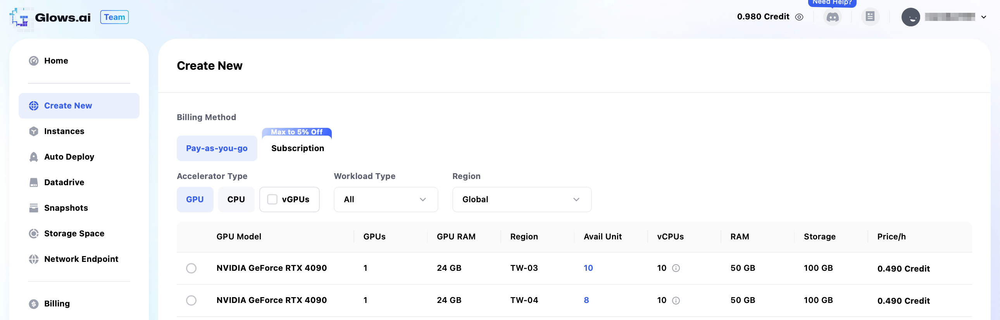

### チームへの参加

一般メンバーは、チーム作成者または管理者が作成したメンバーアカウントを受け取った後、2 つの方法でチームに参加できます。

#### 1> チーム版のログインリンクから

ブラウザで以下のチームログイン画面にアクセスし、チームアカウントのアカウント名とパスワードを入力してください。

```bash
https://platform.glows.ai/team/login
```

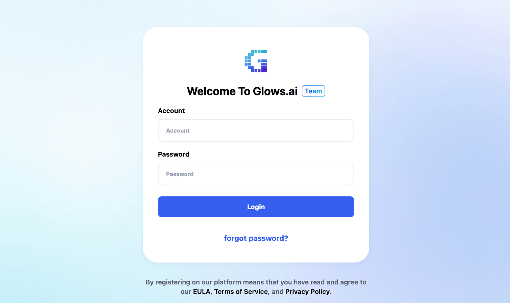


#### 2> Glows.ai の個人版ページから

Glows.ai メインサイトにログイン後、右上のプロフィールアイコンをクリックし、**`Teams` -> `Join Team`** を選択します。

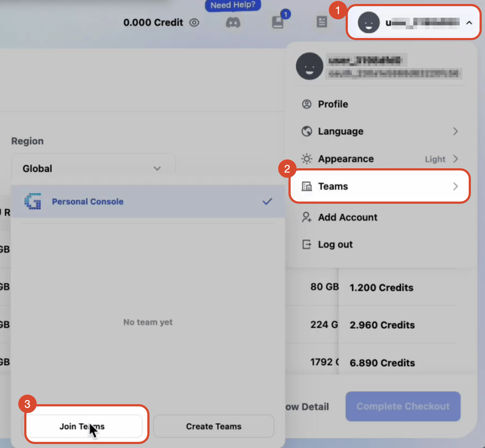

Join Team 画面でチームアカウントのアカウント名とパスワードを入力すると、Glows.ai の個人アカウントとチームを紐づけることができます。以後は、個人ページから直接チームページに切り替えられるようになり、再度チーム版のアカウントでログインする必要はありません。

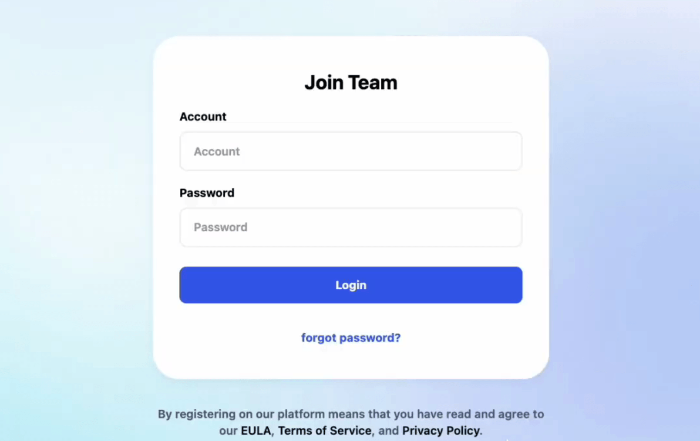


どちらの方法でログインした場合でも、初回ログイン時にはパスワードのリセットが必要になります。

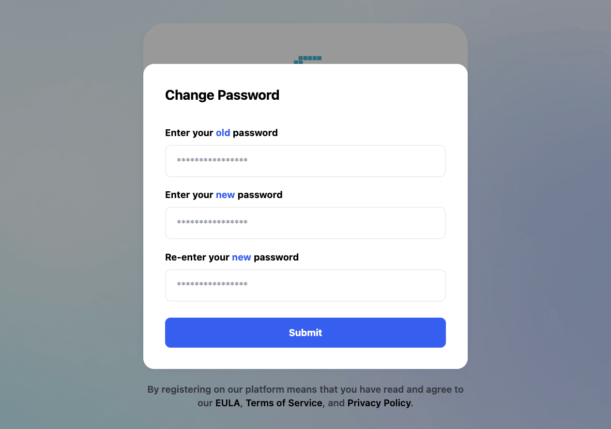

### Credits の入手

チームメンバーが Credits を必要とする場合は、チーム作成者または管理者に申請してください。

### インスタンスの作成

`Create New` をクリックし、レンタルしたい GPU と環境を選択します。

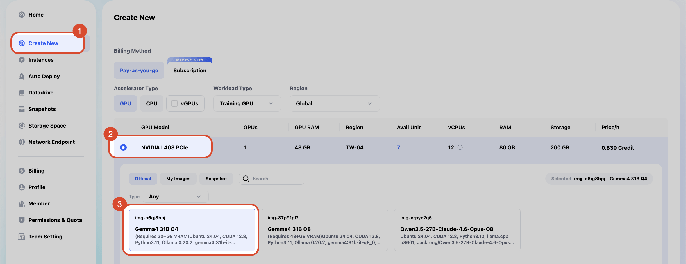

下にスクロールするとインスタンスの設定項目が表示されます。**Mount Team Datadrive** を除き、その他の設定は個人版と同じです。設定が完了したら `Complete Checkout` をクリックしてインスタンス作成を完了します。

- **Unit Qty**：レンタルする GPU の枚数。2 に設定すると 2 枚の GPU をレンタルすることになります。
- **Mount Personal Datadrive**：個人の Datadrive をマウントするかどうかを選択します。
- **Mount Team Datadrive**：チーム共有 Datadrive をインスタンス内の `/team_data` ディレクトリにマウントするかどうかを選択します。チームの **Owner** と **Admin** は読み書き権限を持ち、一般メンバーは読み取り権限のみです。
- **Bind Public IP Address**：固定 IP をバインドします。

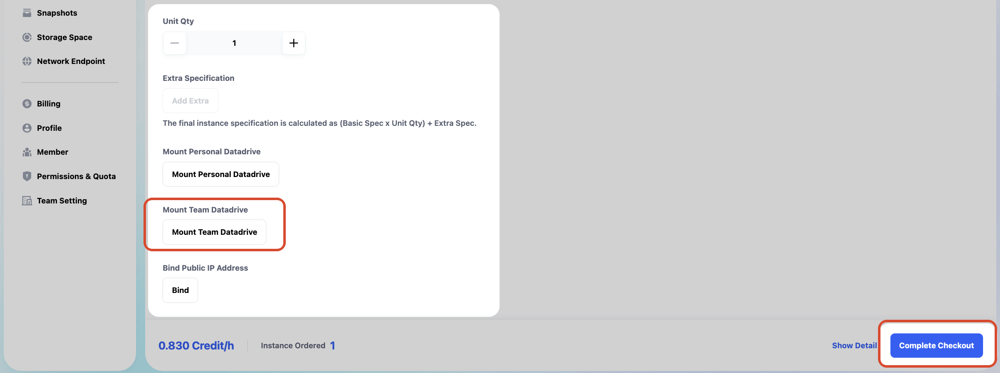

一般のチームメンバーが Team Datadrive をマウントする場合は **読み取り専用（Read only）** 権限のみですが、チームの **Owner** と **Admin** は **読み書き（Read & Write）** 権限を持ちます。


### インスタンス管理

インスタンスの起動が成功すると、Instances 画面で新しく起動したインスタンスを確認できます。インスタンスをクリックすると、より詳細な情報や追加の操作を確認できます。

- **Access:** インスタンスへのアクセス情報。よく使われるのは SSH（Port 22）と JupyterLab（Port 8888）です。
- **Monitor:** インスタンスの CPU・GPU リソースモニタリング。
- **Billing:** インスタンスの課金明細。
- **Config:** インスタンスの設定に関する説明（起動イメージ内のソフトウェアの説明）。
- **Hardware:** インスタンスのハードウェア構成に関する説明。

利用が終わったら、`Action` から `Release` を選択してインスタンスを解放するか、`Take Snapshot` を選択してスナップショットを作成できます。

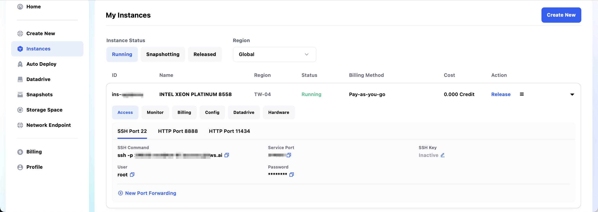

### その他の機能

チーム版内の個人 **Storage Space**、および **Datadrive** 管理（Datadrive）、**Snapshots** 管理（Snapshots）、帳単検索（Billing）、個人情報編集（Profile）は、いずれも個人版ページと同じ操作方法です。詳しくは[Glows.ai 利用マニュアル](https://docs.glows.ai/docs/create-new)をご参照ください。

## お問い合わせ

Glows.ai のご利用中にご不明な点やご提案がございましたら、メール、Discord、または Line からお気軽にお問い合わせください。

**Email:** [support@glows.ai](mailto:support@glows.ai)

**Discord:** [https://discord.com/invite/glowsai](https://discord.com/invite/glowsai)

**Line:** [https://lin.ee/fHcoDgG](https://lin.ee/fHcoDgG)
