# Auto Deploy

**Auto Deploy** ページでは、デプロイプロセスを設定・自動化し、アプリケーションを効率的かつ安全に稼働させることができます。

GPU サービスをデプロイする場合、通常はインスタンスを手動で作成し、利用が終わったら手動で解放する必要があります。利用頻度が不規則であったり、リクエストが散発的な場合、この作業は煩雑になりがちです。

Glows.ai の Auto Deploy サービスはこの課題を解決します。設定が完了すると、システムは固定のサービスリンクを提供します。このリンクにリクエストが送信されると、Glows.ai は設定内容に基づいてリクエストを処理し、自動的にインスタンスを作成して起動コマンドを実行します。連続 n 分間新しいリクエストが届かない場合、Glows.ai は自動的にそのインスタンスを解放します。

つまり、Auto Deploy は「インスタンス作成 → リクエスト処理 → インスタンス解放」を自動化されたループに変えてくれます。ユーザーは固定のサービスリンク 1 つを維持するだけで良く、そのリンクをコードや自動化ワークフローに直接組み込むことができます。インスタンスのライフサイクルを手動で管理する必要はなく、解放を忘れて費用が発生し続ける心配もないため、コスト削減につながります。

以下で機能を詳しくご紹介します：

---
## **Auto Deploy の作成**

### **Auto Deploy の設定**
Auto Deploy 画面に移動し、右上の `New Deploy` をクリックして新規設定を作成し、開始します。

---

- **Deploy Name**：この Auto Deploy の名前。
- **Deploy Description**：この Auto Deploy の説明文。
- **Access Method**：アクセス方法。`Public` または `Private` を選択できます。
- **Instance & Image**：Auto Deploy 経由で起動するマシンタイプとイメージ。自分で設定した Snapshot、またはシステムプリセットのイメージを選択できます。
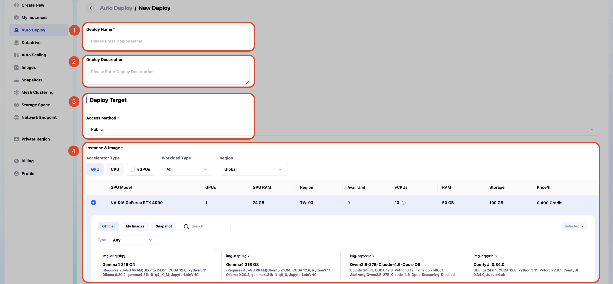

---
- **Port (HTTP/HTTPS)**：外部公開サービスで使用するポート番号。
- **Start Command**：インスタンス起動時に自動実行されるコマンド。
- **Instance Idle Retention Period**：Auto Deploy 経由で起動したインスタンスが、アイドル状態になってから自動解放されるまでの時間。
- **Maximum Number of Instances**：この Auto Deploy が開くことのできる最大インスタンス数。
- 設定が完了したら `Confirm` をクリックします。

### **デプロイの確定**

1. フォームの入力が完了したら、`Confirm` をクリックします。
2. システムが Auto Deploy 設定のデプロイを開始します。デプロイに成功すると、アプリケーションのステータスが **Activated** リストに表示され、Auto Deploy 設定が待機状態になり、呼び出しの準備が完了したことを示します。
4. **Instance Status**：`Standby` はこの Auto Deploy が呼び出しを待機していることを、`Running` はこの Auto Deploy を通じてインスタンスが現在起動していることを示します。
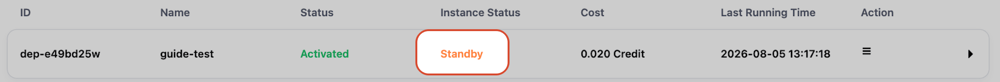
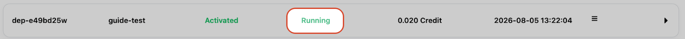

---

## **Auto Deploy のステータス**

### **Auto Deploy の基本情報**

**Auto Deploy** ページでは、次の 2 種類のデプロイステータスを確認できます：

1. **Activated**：Auto Deploy が有効化され、待機状態になっています。
2. **Suspended**：Auto Deploy サービスが一時停止され、稼働していません。
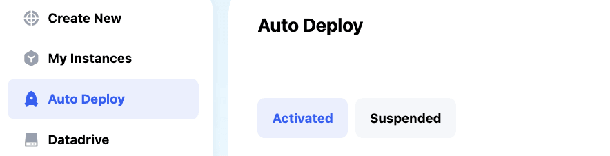

**各デプロイタスクの一覧には、以下の項目が含まれます**：

- **ID**：各デプロイタスクの一意の識別子。
- **Name**：デプロイタスクの名前。
- **Status**：現在のデプロイステータス（Activated、Suspended）。
- **Instance Status**：インスタンスの現在の稼働状況（例：Standby、Running）。
- **Cost**：このデプロイで消費されたリソース費用。
- **Last Running Time**：最後に実行された時刻。
- **Action**：デプロイに対して実行できる操作（詳細は下記参照）。
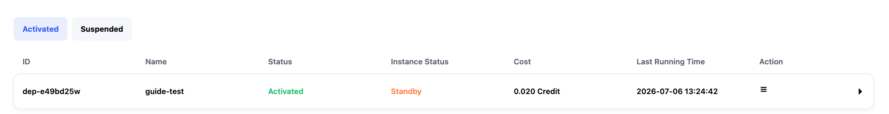
---

### **Auto Deploy の詳細情報**

**右側の矢印をクリックすると、詳細情報が表示されます**：

1. **ID／Auto Deploy Name／Auto Deploy Description**：このデプロイの基本情報。作成時に入力した名前と説明。
2. **Instance Preview**：このデプロイに設定されたマシンタイプとイメージのプレビュー。Image、GPU/CPU スペック、RAM、Storage などを含み、作成時の設定内容と同じです。
3. **Service & Start Command**：
    - **Access Method**：この Auto Deploy のアクセス方法。
    - **URL**：このサービスへアクセスするための URL。実際に接続・呼び出しを行う際に使用するエンドポイントです。
    - **Port**：URL に対応するサービスポート。
    - **Start Command**：Auto Deploy のインスタンス起動時に自動実行されるコマンド（設定されている場合）。
4. **Deployment Control**：アイドル解放時間や最大インスタンス数などのデプロイ管理設定。作成時の設定内容と同じです。
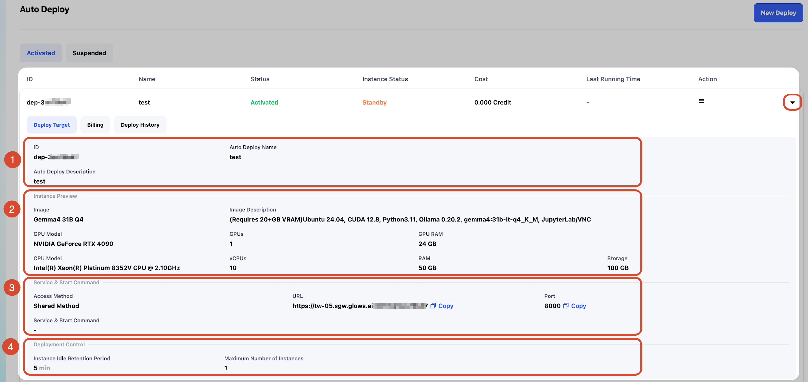

---

## **Auto Deploy で実行できる操作**

**Action** 列では、以下の操作を行うことができます：

### **1. Edit**

- **機能**：デプロイ設定を編集します。
- **利用シーン**：デプロイ名、環境変数、その他の設定を変更する必要がある場合に使用します。

### **2. Suspend**

- **機能**：デプロイを一時停止し、アプリケーションの稼働を停止します。
- **利用シーン**：アプリケーションの稼働が不要になった場合、デプロイを一時停止することでリソースコストを節約できます。

### **3. Deploy**

- **機能**：アプリケーションを起動、または再デプロイします。
- **利用シーン**：設定済みの Auto Deploy を通じてインスタンスを起動します。これは Auto Deploy が提供する URL を使用することと同等です（URL の詳細については、利用マニュアルの `Glows.ai Auto Deploy 使用案例` の章をご参照ください）。
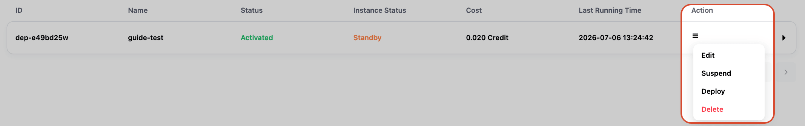

### **4. Delete**

- **機能**：デプロイタスクを削除します。
- **利用シーン**：この Auto Deploy が不要になった場合にデプロイタスクを削除できます。**削除後は元に戻せません。**

### **5. Resume**

- **機能**：一時停止中の Auto Deploy 設定を復帰させます。
- **利用シーン**：Auto Deploy 設定が Suspended 状態にあり、再起動が必要な場合、この操作で Activated 状態に戻すことができます。その後 `Deploy` をクリックしてインスタンスをデプロイできます。
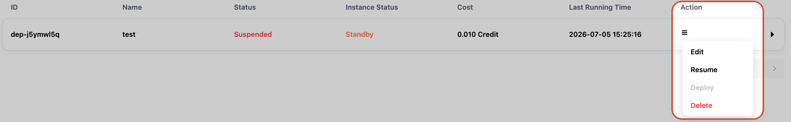

### **6. Release**

- **機能**：Auto Deploy 経由で起動したインスタンスを解放し、Released 状態に変更します。
- **利用シーン**：デプロイ済みのインスタンスが不要になった場合、`Release` をクリックしてリソースを解放し、課金を停止できます。
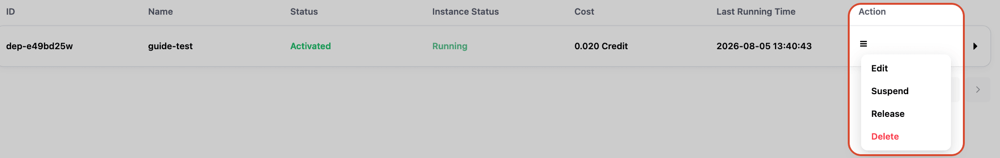

---

## **Auto Deploy の基本的な使い方**

1. Auto Deploy 画面で、使用したい Auto Deploy のサービス URL をコピーします。この URL はサービスをトリガーするための固定エントリーポイントです。
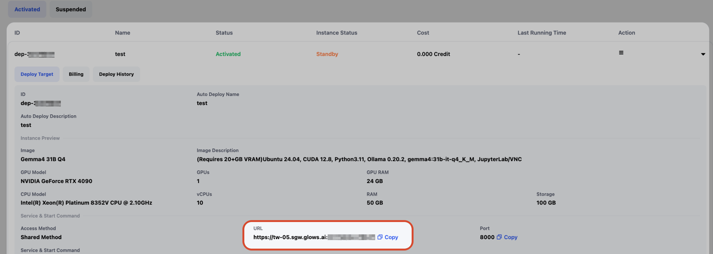

2. ブラウザでこの URL を開くか、curl を使ってこの URL にリクエストを送信します。

3. リクエストの処理が完了したら、My Instances 画面に戻ると、Auto Deploy 経由でマシンが正常にトリガー・起動されたことを確認できます。
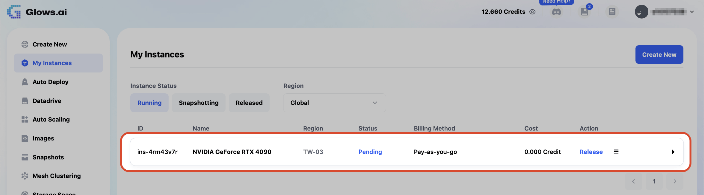

4. この Auto Deploy を作成する際に Instance Idle Retention Period を設定していた場合、その時間を超えてリクエストが届かない状態が続くと、インスタンスは手動操作なしで自動的に解放されます。
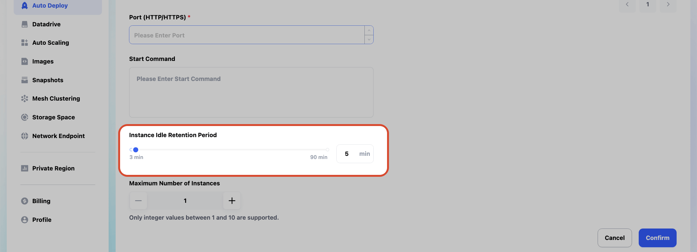

---

## **注意事項**

- **アプリケーションの削除は取り消せません**：アプリケーションを削除すると、復元することはできません。

- **一時停止でリソースを節約**：Auto Deploy 設定を一時的に無効化したい場合は、`Suspend` を選択してください。

- **デプロイ前に設定を確認**：デプロイエラーを避けるため、設定内容が正しいことを必ず確認してください。

---

**以上が Auto Deploy に関する完全なガイドです。より詳しい操作手順や利用ケースについては、[Glows.ai Auto Deploy 使用案例](https://docs.glows.ai/docs/auto-deploy-usage)をご参照ください。**
