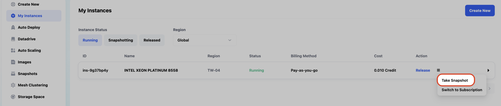
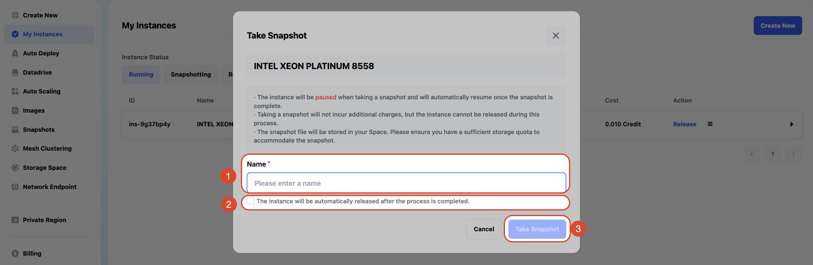
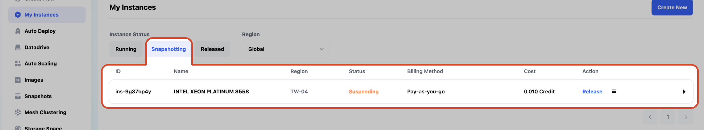
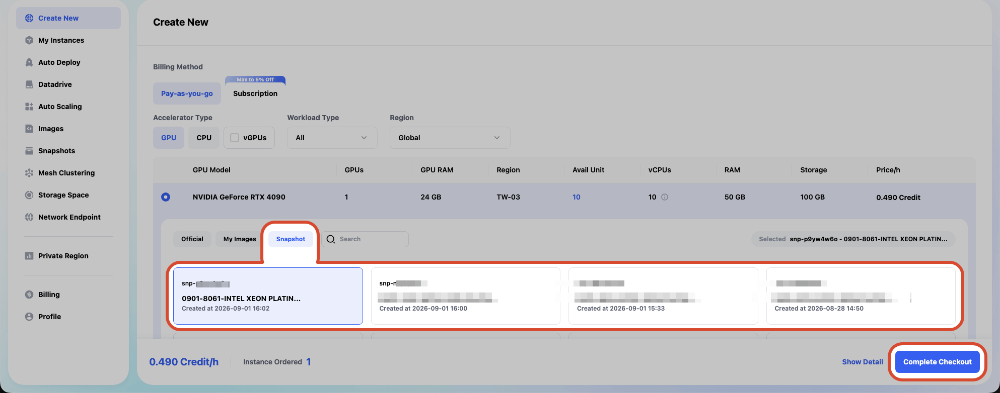
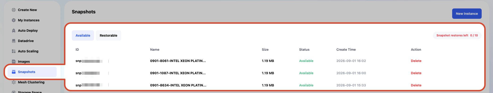
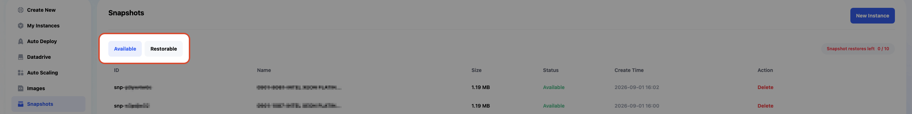
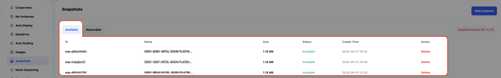
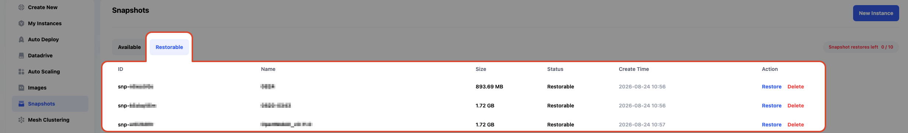
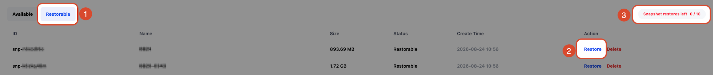

# Snapshots

**Snapshot**（**快照**）是用於保存實例當下的環境設定狀態，例如已安裝的套件、開發環境配置等。當您調整好開發環境後，可建立 Snapshot 作為存檔點，將實例當前狀態備份，後續能夠在建立實例時，透過使用 Snapshot，快速還原實例的狀態，不需重新設定。

以下是功能介紹與操作指南：

---

## **Snapshot 與 Image 計費方式調整通知**

為提供更彈性且便利的環境與資料管理體驗，平台將於 **2026 年 12 月 1 日 00:00（UTC+8）** 起調整 Snapshot 與 Image 的配額及計費機制。
調整後，Storage 套餐配額將僅適用於 Datadrive 儲存空間；Snapshot 與 Image 將不再佔用 Storage 配額，並改採依實際使用容量進行按時計費。
新的計費規則如下：
- 計費單價：0.0001 credits / 小時 / GB
- 當 Snapshot 或 Image 建立成功後，系統將開始計費
- 當 Snapshot 或 Image 被刪除後，系統將停止計費

此調整旨在讓用戶能更靈活地管理儲存資源，並依實際使用情況進行成本管理。

如有任何疑問，請透過以下方式聯繫我們：
[點擊這裡聯繫我們](/docs/contact-us)

## 建立 Snapshot

  - 在機器處於運行狀態時，您可以點擊機器右側的功能表，並點擊 `Take Snapshot`，開始建立 Snapshot。
    > 請注意，建立 Snapshot 期間，實例將暫停運行

  

   1. **Name**：填寫 Snapshot 名稱。
   2. **The instance will be automatically released after the process is completed**：
      若勾選此選項，Snapshot 製作完成後，實例將自動釋放；
      若未勾選，Snapshot 完成後實例將自動恢復為 Running 狀態，您可繼續使用該實例。
   3. 填寫完畢後，點擊 Take Snapshot 開始建立。

  - 保存過程中，實例會從`Running`移動至 `Snapshotting` 的標籤頁，此時實例的狀態轉變爲`Suspending`。

   - Snapshot 建立完成後：實例將會：
    1. 繼續運行。
    2. 自動釋放（若您在點擊 Take Snapshot 時有勾選 **The instance will be automatically released after the process is completed**）
  

---

## 使用 Snapshot

  - 在創建機器時，點擊 Snapshot 標籤頁，您可以看到您的 Snapshot，即可透過 Snapshot 建立實例，實例將會還原為建立 Snapshot 當時的狀態。
    > **注意事項**：Snapshot 支持跨區（**Region**）使用，例如：您使用 `TW-03` 的實例所建立的 Snapshot，能夠讓您在創建其他區域（**Region**）（例如：`TW-04`）的實例時使用。注意：跨區使用 Snapshot 時，第一次啟動會較慢，往後因為快取的原因，將較第一次啟動快。

---

## Snapshot 列表

主畫面中，點擊左側功能列表的 Snapshot 後，您可以看到所有 Snapshot 的清單

---

### Snapshot 狀態

  1. **Available** 標籤頁顯示所有可用的 Snapshot，您可以查看並管理當前的 Snapshot 列表。
  2. **Restorable** 標籤頁顯示已刪除或因您的 Storage Space 不足而無法提供使用的 Snapshot，這些 Snapshot 仍然可以在一定時間內恢復。
  

  ### Available
    **Snapshot 資訊欄位**：
    - **ID**：Snapshot 的唯一標識符。
    - **Name**：Snapshot 名稱，方便用戶辨識。
    - **Size**：Snapshot 所佔用的存儲空間大小。
    - **Status**：Snapshot 的當前狀態（例如：`Available`）。
    - **Create Time**：Snapshot 的創建時間。
    - **Action**：可執行的操作（僅有`Delete`）。
      > 使用`Delete`後會將該 Snapshot 移至 **Restorable** 標籤頁。
    
    
  ### Restorable
    **Snapshot 資訊欄位**:
    - **除了 Action 之外，其餘與 Available 標籤頁的欄位相同**。
    - **Action**：可執行的操作（`Restore`或`Delete`）。
      > 注意：對 Restorable 中 的 Snapshot 使用`Delete`將會永久刪除該 Snapshot。

    

    **將 Restorable 的 Snapshot 進行 Restore**：
      
      進行 Restore 後，Snapshot 將從 `Restorable` 移至 `Available`，變為可使用的狀態。
          
    1. 點擊 `Restorable` 標籤頁。
    2. 點擊 `Restore`。
    3. Restore 後，將消耗`Snapshot restores left`次數。
          

---

## **注意事項**

- **刪除與恢復**：
  刪除 Snapshot 後，它會移至 **Restorable** 標籤頁，您可以選擇恢復或永久刪除。

- **修改名稱**：
  您可以隨時修改 Snapshot 的名稱，方便管理與識別。

- **存儲空間管理**：
  定期清理不必要的 Snapshot 可以釋放存儲空間，確保資源有效使用。

通過這些功能，您可以輕鬆地管理和保護您的數據，確保在需要時能夠快速恢復至某個特定狀態。
